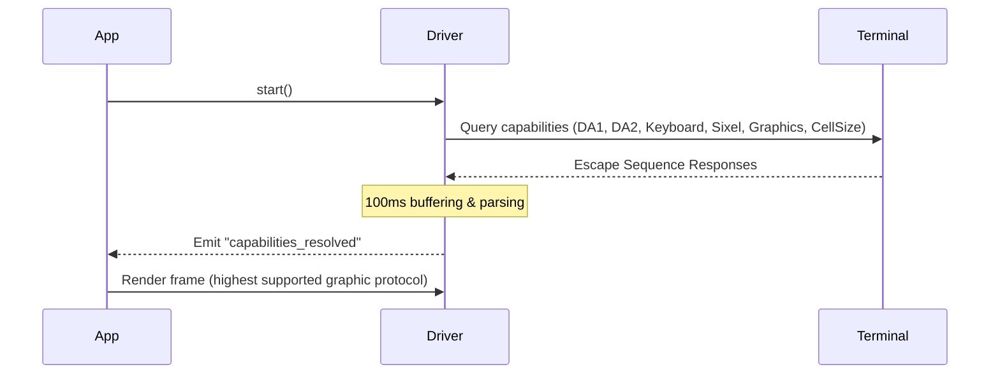

# ztui

A premium, declarative, React-based Text User Interface (TUI) framework for TypeScript and Bun, featuring dynamic terminal capability probing, advanced graphic protocols, and graceful fallbacks.

```tsx
// app.tsx — run with: bun run app.tsx
import { useState } from "react";
import { App } from "ztui";
import { Button, Label, render, VBox } from "ztui/react";

function Counter() {
  const [count, setCount] = useState(0);

  return (
    <VBox style={{ width: 40, height: 10, align: "center", verticalAlign: "middle" }}>
      <Label style={{ bold: true, color: "cyan" }}>Count: {count}</Label>
      <Button onClick={() => setCount(count + 1)} style={{ background: "blue", color: "white" }}>
        Increment
      </Button>
    </VBox>
  );
}

// Mount the tree onto the App's screen, then start the render/event loop.
const app = new App();
render(<Counter />, app.activeScreen);
app.run();
```

Press `Tab` to focus the button, `Enter`/`Space` to increment, and `Ctrl+C` to quit.

## Why ztui

Most TUI toolkits sit at one of two extremes. Some are **too primitive** — raw
ANSI or thin wrappers where you hand-roll layout, focus, scrolling, and every
widget yourself. Others chase **maximal performance** with native render
backends: fast, but hard to see into. The UI exists only as bytes on a terminal,
so debugging is print-statements-and-squinting and there's nothing concrete to
assert on in a test.

ztui takes a different bet. On a modern machine a TUI paints a few thousand
cells — raw render throughput is rarely the bottleneck; **iteration speed and
debuggability are.** That matters more than ever now that so much code is written
and maintained by LLMs and agents, which can't watch a terminal scroll by. So
ztui optimizes for a model you *and an agent* can reason about, test, and operate:

- One declarative **React** tree — a familiar mental model, hooks and all.
- The widget DOM and the rendered frame **serialize to JSON / HTML / text**.
- **Headless drivers and a REST inspector** let humans, CI, and agents *see* and
  *assert* on the UI without a real terminal.

This isn't "slow but debuggable." ztui stays performance-conscious — ANSI cell
diffing, list/table virtualization, synchronized output, lazy graphics — it just
**trades a sliver of raw native throughput for a framework that's legible
end-to-end.** If you're rendering a 60fps fullscreen game in the terminal, reach
for a native engine. If you're building tools, dashboards, agent UIs, and dev
experiences — and want them testable and AI-operable — that's the gap ztui fills.

See [Debugging & AI agents](https://huyz0.github.io/ztui/guides/debugging/) for
how the inspectability works in practice.

## Contents

- [Why ztui](#why-ztui)
- [Features](#features)
- [Installation](#installation) — slim core + opt-in entry points
- [Layout and Styling System](#layout-and-styling-system)
- [Active Terminal Capability Probing](#active-terminal-capability-probing)
- [Vector SVG Graphics & Heroicons](#vector-svg-graphics--heroicons)
- [Headless Integration Testing](#headless-integration-testing)
- [Development & Demos](#development--demos)
- [Quality Gates](#quality-gates)
- [Documentation](#documentation)

---

## Features

- **React-Reconciler Integration**: Build complex, interactive TUI layouts with declarative JSX, component states, and hooks.
- **Dynamic CSS Specificity & Cascade**: Style widgets via cascading stylesheets with proper selector specificity and inline override preservation.
- **Dynamic Terminal Probing**: Automatically queries terminal capabilities at startup:
  - Truecolor (24-bit) & 256-color fallback.
  - Kitty Keyboard Protocol support for advanced modifiers and special keys.
  - Synchronized Updates (OSC 2026) to prevent frame tearing/flickering.
  - Clipboard integration (OSC 52) & Desktop Notifications (OSC 9 / OSC 777).
- **High-Fidelity Graphics Engines**:
  - **Kitty & iTerm2 Graphics**: Displays inline rasterized SVGs dynamically scaled to terminal cell dimensions.
  - **Sixel Graphics**: High-performance fallback with a custom **16-color antialiasing alpha blender** and two-pass rendering for transparent container layers.
  - **Glyph Protocol**: Registers custom vector SVGs directly to terminal-side fonts (APC protocol).
  - **Aspect-Ratio-Preserving Probing**: Automatically queries cell dimensions (CSI 16t) to scale graphics to your active terminal font size.
- **Flex-like Layout System**: Complete grid alignment, dock panels, and box margin tracking with bresenham-style rounding distribution to avoid visual grid gaps.
- **Headless Virtual Terminal Emulator (VTE) Tests**: A `VTEDriver` streams output directly into `@xterm/headless` to verify terminal-grid attributes, colors, custom graphics, and mouse-hover events.
- **Built-in HTML Inspector**: Spin up a live browser-based server to inspect your terminal buffer layout in real-time.

---

## Installation

```bash
bun add ztui
```

`ztui` ships as a slim core with **opt-in entry points**, so you only install the
dependencies for the features you actually use. The core entry pulls no React and
no heavy rendering engines.

| Import | What you get | Install alongside |
|--------|--------------|-------------------|
| `ztui` | Core: `App`, `Widget`, `Screen`, drivers, geometry, render, theme, animations, and all imperative widgets | — |
| `ztui/react` | React reconciler `render` + all JSX components and hooks | `bun add react react-reconciler` |
| `ztui/markdown` | Markdown engine + `MarkdownWidget` | `bun add marked` (code blocks highlight if `prismjs` is present; ` ```mermaid ` blocks render if `ztui/mermaid` is imported) |
| `ztui/syntax` | Syntax highlighting engine + `SyntaxWidget` | `bun add prismjs` (without it, code renders as plain text) |
| `ztui/mermaid` | Mermaid diagrams + `MermaidWidget` | `bun add beautiful-mermaid` (`sharp` enables the SVG render path) |

These extras are declared as **optional `peerDependencies`** — they are never
installed automatically, and the widgets that need them throw an actionable error
(or degrade gracefully) when they are missing. SVG-icon rasterization (kitty/iTerm)
uses an optional `sharp`; seti file icons use an optional `opentype.js`; both fall
back to unicode glyphs when absent.

```tsx
// A React app that renders markdown with highlighted code blocks:
import { App } from "ztui";
import { render, Markdown } from "ztui/react";
import "ztui/markdown"; // registers the widget + pulls `marked`
import "ztui/syntax";   // optional: highlight fenced code via `prismjs`
```

---

## Layout and Styling System

`ztui` implements standard CSS box model and Flexbox sizing properties, resolving styles dynamically across containers:

### Layout Elements
- `<Box>`: Base container element (`ztui-box`) that supports margin allocations, border calculations, and transparent background propagation.
- `<View>`: A minimal generic container (`ztui-view`, the base `Widget`) — layout and background only, no border. Handy as a neutral, semantic root.
- `<VBox>`: Vertical layout organizer mapping child sizes and flex-growth.
- `<HBox>`: Horizontal layout organizer.
- `<Grid>`: Configurable structural cell layouts.
- `<Dock>`: Dock-based layout alignments.

### Custom Styling Props
```typescript
interface WidgetStyles {
  layout?: "vertical" | "horizontal" | "dock" | "grid";
  display?: "flex" | "grid" | "dock";
  flexDirection?: "row" | "column";
  flexGrow?: number;
  width?: string | number;
  height?: string | number;
  margin?: number | { top?: number; bottom?: number; left?: number; right?: number };
  color?: string;       // Supports Hex (#ff0000), RGB, basic ANSI colors, or "default"
  background?: string;  // Supports Hex, RGB, "default", or "transparent"
  bold?: boolean;
  italic?: boolean;
  underline?: boolean;
  strikethrough?: boolean;
  link?: string;        // OSC 8 terminal hyperlink
  align?: "left" | "center" | "right";          // Horizontal alignment of children
  verticalAlign?: "top" | "middle" | "bottom";  // Vertical alignment of children
}
```

> [!TIP]
> **Strikethrough Decoration**: If both `underline` and `strikethrough` are active, they compile into the terminal sequences `\x1b[4:1m` (underline, colon sub-parameter form) and `\x1b[9m` (strikethrough), and translate in HTML to `text-decoration: underline line-through` without visual artifacts.

---

## Active Terminal Capability Probing

At startup, the `BunDriver` queries your active terminal emulator using non-blocking asynchronous control sequences:



### Protocol Fallback Chain
1. **Graphics**: `Kitty Graphics` $\rightarrow$ `iTerm2 File` $\rightarrow$ `Sixel` $\rightarrow$ `Glyph Protocol` $\rightarrow$ `Text Unicode Blocks`
2. **Color**: `Truecolor (24-bit)` $\rightarrow$ `256-Color (Quantum Compressed)` $\rightarrow$ `16-Color (Euclidean ANSI Distance)`
3. **Mouse Tracking**: Mouse Hover (`1003h`) $\rightarrow$ Click & Drag (`1000h` / `1002h`)

---

## Vector SVG Graphics & Heroicons

`ztui` handles vector graphics natively through the `<Icon>` and `<HeroIcon>` components. 

### Custom SVG Icon Registration
```typescript
import { iconRegistry } from "ztui";

iconRegistry.register("my-icon", {
  svg: `<svg viewBox="0 0 24 24"><circle cx="12" cy="12" r="10" fill="currentColor"/></svg>`,
  textFallback: "●"
});
```

### Heroicons Integration
The `<HeroIcon>` wrapper automatically loads, sanitizes, and registers icons from the standard `heroicons` package:

```tsx
import { HBox, HeroIcon } from "ztui/react";

function IconRow() {
  return (
    <HBox>
      {/* Dynamic color injection mapping parent backgrounds and text colors */}
      <HeroIcon name="academic-cap" variant="outline" style={{ color: "yellow" }} />
      <HeroIcon name="beaker" variant="solid" style={{ color: "emerald" }} />
    </HBox>
  );
}
```

---

## Headless Integration Testing

Apps run fully headless in CI — no TTY required. Drive the real
React→DOM→layout→buffer pipeline with the in-memory `MockDriver`, then assert on
the composed cell grid via `renderBufferToText` (or `renderBufferToHTML` to check
colors/styles as inline-styled spans):

```tsx
import { expect, test } from "vitest";
import { App, MockDriver, renderBufferToText } from "ztui";
import { Label, render } from "ztui/react";

test("renders to the cell grid", async () => {
  const app = new App(new MockDriver(80, 24));

  render(<Label style={{ color: "cyan" }}>Hello TUI</Label>, app.activeScreen);
  app.run();

  // React commits and the render queue flush on a microtask — wait one tick.
  await new Promise((resolve) => setTimeout(resolve, 15));

  expect(renderBufferToText(app.buffer)).toContain("Hello TUI");

  app.stop(); // unbind listeners and release the App singleton
});
```

For terminal-attribute fidelity (real SGR colors, mouse-hover, graphics), the
repo's own suites pipe a `VTEDriver` into `@xterm/headless`; see
[`docs/testing_standards.md`](docs/testing_standards.md) and the `mountApp`
harness in [`src/test/harness.tsx`](src/test/harness.tsx).

---

## Development & Demos

All examples live in one browsable **demo gallery** — pick a demo from the
grouped sidebar and it mounts in place. The same gallery runs on the terminal
or, unchanged, in a browser via the WebDriver canvas backend.

```bash
# Open the gallery (terminal)
bun run demo            # alias: bun run dev

# Open the gallery in a browser (WebDriver canvas → http://localhost:3010)
bun run demo:web

# List every demo id (grouped)
bun run demo:list

# Launch a single demo directly, on either backend
bun run examples/gallery/run.tsx table
bun run examples/gallery/run.tsx heroicons --web
```

Each demo is a `Demo` module (a component + metadata) registered in
[`examples/gallery/registry.ts`](examples/gallery/registry.ts) — the single
source of truth for the gallery, the `--list` output, and the CLI handle.
Adding a demo is one export plus one registry line; no new npm script needed.

```bash
# Headless-debug the web backend: screenshot + pixel-accurate grid report
bun run web:debug                       # screenshots examples/web_demo_ui
bun run web:debug --module ./my-ui.tsx  # any module default-exporting a UI
```

The web backend renders the same widget tree to a browser instead of a terminal.
The `WebDriver` hands each composed cell grid to a **hardware-accelerated
`<canvas>`** (`renderBufferToCanvas`): backgrounds and block elements are drawn as
rectangles and **box-drawing as vector strokes**, so borders and rounded corners
are pixel-perfect and there's no line-box/line-height to fight. The bundled
**Cascadia Mono** webfont (MIT) supplies the glyphs and the **Seti** icon font the
file-type glyphs. (`renderBufferToHTML` remains for the REST inspector and tests.)
`web:debug` drives the page in headless Chromium via Playwright (the
`WebInspector` harness), so any coding agent can *see* and verify the web UI —
screenshots plus a canvas/cell-metrics report — with no human at a browser.

---

## Quality Gates

- **Formatter & Linter**: Configured with Biome. To auto-format codebase:
  ```bash
  bun run lint:fix
  ```
- **Type Checking**: Strict TypeScript, enforced in the pre-commit hook:
  ```bash
  bun run typecheck
  ```
- **Test Runner & Coverage**: Tests are executed via Vitest with v8 coverage:
  ```bash
  bun run test           # unit + integration, with coverage
  bun run test:e2e       # end-to-end (spawns the real binary)
  ```
  Coverage is gate-enforced (lines ≥ 90%, functions ≥ 90%, statements ≥ 88%,
  branches ≥ 70%); the suite currently sits at **~91% line / ~89% statement**.
  See `bun run test` output for the live number.

All three gates (lint, type-check, tests+coverage) run automatically on every
commit via the version-controlled `.githooks/pre-commit` hook.

---

## Documentation

Deep-dive design docs live in [`docs/`](docs/):

- [architecture.md](docs/architecture.md) — layer boundaries, the render pipeline, the portable cell model, and the backend-agnostic vs. terminal-specific split.
- [coding_standards.md](docs/coding_standards.md) — module/design rules, React wrapper patterns, driver-concern containment.
- [testing_standards.md](docs/testing_standards.md) — the unit/integration/E2E taxonomy, the `mountApp` harness, and coverage gates.
- [diagnostics.md](docs/diagnostics.md) — the REST inspector endpoints and the file-only logger.
- [tdd_workflow.md](docs/tdd_workflow.md) · [git_best_practices.md](docs/git_best_practices.md) · [code_review.md](docs/code_review.md) — process guides.
