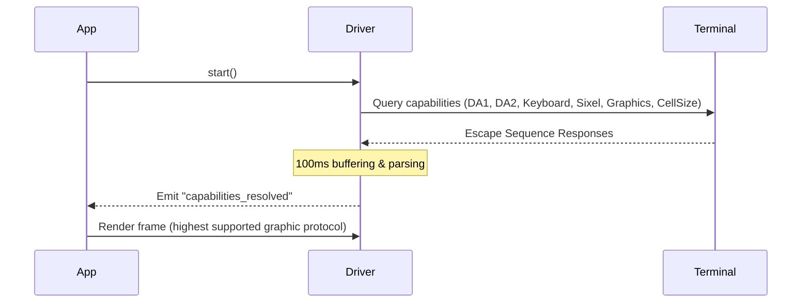

# ztui

A premium, declarative, React-based Text User Interface (TUI) framework for TypeScript and Bun, featuring dynamic terminal capability probing, advanced graphic protocols, and graceful fallbacks.

```tsx
import React, { useState } from "react";
import { App, View, Button, Label } from "ztui";

function Counter() {
  const [count, setCount] = useState(0);

  return (
    <View style={{ layout: "vertical", width: 40, height: 10, align: "center", justify: "center" }}>
      <Label style={{ bold: true, color: "cyan" }}>Count: {count}</Label>
      <Button onClick={() => setCount(count + 1)} style={{ background: "blue", color: "white" }}>
        Increment
      </Button>
    </View>
  );
}
```

---

## Features

- **React-Reconciler Integration**: Build complex, interactive TUI layouts with declarative JSX, component states, and hooks.
- **Dynamic CSS Specificity & Cascade**: Style widgets via cascading stylesheets with proper selector specificity and inline override preservation.
- **Dynamic Terminal Probing**: Automatically queries terminal capabilities at startup:
  - Truecolor (24-bit) & 256-color fallback.
  - Kitty Keyboard Protocol support for advanced modifiers and special keys.
  - Synchronized Updates (OSC 2026) to prevent frame tearing/flickering.
  - Clipboard integration (OSC 52) & Desktop Notifications (OSC 9 / OSC 777).
- **High-Fidelity Graphics Engines**:
  - **Kitty & iTerm2 Graphics**: Displays inline rasterized SVGs dynamically scaled to terminal cell dimensions.
  - **Sixel Graphics**: High-performance fallback with a custom **16-color antialiasing alpha blender** and two-pass rendering for transparent container layers.
  - **Glyph Protocol**: Registers custom vector SVGs directly to terminal-side fonts (APC protocol).
  - **Aspect-Ratio-Preserving Probing**: Automatically queries cell dimensions (CSI 16t) to scale graphics to your active terminal font size.
- **Flex-like Layout System**: Complete grid alignment, dock panels, and box margin tracking with bresenham-style rounding distribution to avoid visual grid gaps.
- **Headless Virtual Terminal Emulator (VTE) Tests**: Mock driver streams piped directly to `@xterm/headless` to verify terminal-grid attributes, colors, custom graphics, and mouse-hover events.
- **Built-in HTML Inspector**: Spin up a live browser-based server to inspect your terminal buffer layout in real-time.

---

## Installation

```bash
bun install ztui
```

Make sure the following dependencies are installed to support graphics and terminal testing:
```bash
# Developer and graphics tools
bun add @resvg/resvg-js heroicons
bun add -d @xterm/headless vitest @biomejs/biome
```

---

## Layout and Styling System

`ztui` implements standard CSS box model and Flexbox sizing properties, resolving styles dynamically across containers:

### Layout Elements
- `<Box>`: Base container element (`ztui-box`) that supports margin allocations, border calculations, and transparent background propagation.
- `<VBox>`: Vertical layout organizer mapping child sizes and flex-growth.
- `<HBox>`: Horizontal layout organizer.
- `<Grid>`: Configurable structural cell layouts.
- `<Dock>`: Dock-based layout alignments.

### Custom Styling Props
```typescript
interface WidgetStyles {
  display?: "flex" | "block" | "none";
  flexDirection?: "vertical" | "horizontal";
  flexGrow?: number;
  width?: string | number;
  height?: string | number;
  margin?: number | { top?: number; bottom?: number; left?: number; right?: number };
  color?: string;       // Supports Hex (#ff0000), RGB, basic ANSI colors, or "default"
  background?: string;  // Supports Hex, RGB, "default", or "transparent"
  bold?: boolean;
  italic?: boolean;
  underline?: boolean;
  strikethrough?: boolean;
  link?: string;        // OSC 8 terminal hyperlink
  align?: "left" | "center" | "right";
}
```

> [!TIP]
> **Strikethrough Decoration**: If both `underline` and `strikethrough` are active, they compile into terminal sequences `\x1b[4;9m` and translate in HTML to `text-decoration: underline line-through` without visual artifacts.

---

## Active Terminal Capability Probing

At startup, the `BunDriver` queries your active terminal emulator using non-blocking asynchronous control sequences:



### Protocol Fallback Chain
1. **Graphics**: `Kitty Graphics` $\rightarrow$ `iTerm2 File` $\rightarrow$ `Sixel` $\rightarrow$ `Glyph Protocol` $\rightarrow$ `Text Unicode Blocks`
2. **Color**: `Truecolor (24-bit)` $\rightarrow$ `256-Color (Quantum Compressed)` $\rightarrow$ `16-Color (Euclidean ANSI Distance)`
3. **Mouse Tracking**: Mouse Hover (`1003h`) $\rightarrow$ Click & Drag (`1000h` / `1002h`)

---

## Vector SVG Graphics & Heroicons

`ztui` handles vector graphics natively through the `<Icon>` and `<HeroicIcon>` components. 

### Custom SVG Icon Registration
```typescript
import { iconRegistry } from "ztui";

iconRegistry.register("my-icon", {
  svg: `<svg viewBox="0 0 24 24"><circle cx="12" cy="12" r="10" fill="currentColor"/></svg>`,
  textFallback: "●"
});
```

### Heroicons Integration
The `<HeroicIcon>` wrapper automatically loads, sanitizes, and registers icons from the standard `heroicons` package:

```tsx
import React from "react";
import { HeroicIcon } from "ztui";

function App() {
  return (
    <HBox>
      {/* Dynamic color injection mapping parent backgrounds and text colors */}
      <HeroicIcon name="academic-cap" variant="outline" style={{ color: "yellow" }} />
      <HeroicIcon name="beaker" variant="solid" style={{ color: "emerald" }} />
    </HBox>
  );
}
```

---

## Headless Integration Testing

Ensure pixel-perfect layouts using our Virtual Terminal Emulator (VTE) harness:

```typescript
import { describe, expect, test } from "vitest";
import React from "react";
import { VTEDriver } from "./src/test/vte-runner";
import { App, render, Label } from "ztui";

describe("TUI Integration", () => {
  test("assert screen contents", async () => {
    const vte = new VTEDriver(80, 24);
    const app = new App(vte);

    render(<Label style={{ color: "cyan" }}>Hello VTE</Label>, app.activeScreen);
    app.run();

    await new Promise((resolve) => setTimeout(resolve, 50));

    // Verify cell contents
    const line = vte.getLineText(0);
    expect(line.includes("Hello VTE")).toBe(true);

    // Verify character color attributes
    const cell = vte.getCell(0, 0);
    expect(cell.fg).toBe("cyan");
  });
});
```

---

## Development & Demos

All examples live in one browsable **demo gallery** — pick a demo from the
grouped sidebar and it mounts in place. The same gallery runs on the terminal
or, unchanged, in a browser via the WebDriver canvas backend.

```bash
# Open the gallery (terminal)
bun run demo            # alias: bun run dev

# Open the gallery in a browser (WebDriver canvas → http://localhost:3010)
bun run demo:web

# List every demo id (grouped)
bun run demo:list

# Launch a single demo directly, on either backend
bun run examples/gallery/run.tsx table
bun run examples/gallery/run.tsx heroicons --web
```

Each demo is a `Demo` module (a component + metadata) registered in
[`examples/gallery/registry.ts`](examples/gallery/registry.ts) — the single
source of truth for the gallery, the `--list` output, and the CLI handle.
Adding a demo is one export plus one registry line; no new npm script needed.

```bash
# Headless-debug the web backend: screenshot + pixel-accurate grid report
bun run web:debug                       # screenshots examples/web_demo_ui
bun run web:debug --module ./my-ui.tsx  # any module default-exporting a UI
```

The web backend renders the same widget tree to a browser instead of a terminal.
The `WebDriver` hands each composed cell grid to a **hardware-accelerated
`<canvas>`** (`renderBufferToCanvas`): backgrounds and block elements are drawn as
rectangles and **box-drawing as vector strokes**, so borders and rounded corners
are pixel-perfect and there's no line-box/line-height to fight. The bundled
**Cascadia Mono** webfont (MIT) supplies the glyphs and the **Seti** icon font the
file-type glyphs. (`renderBufferToHTML` remains for the REST inspector and tests.)
`web:debug` drives the page in headless Chromium via Playwright (the
`WebInspector` harness), so any coding agent can *see* and verify the web UI —
screenshots plus a canvas/cell-metrics report — with no human at a browser.

---

## Quality Gates

- **Formatter & Linter**: Configured with Biome. To auto-format codebase:
  ```bash
  bun run lint:fix
  ```
- **Test Runner & Coverage**: Tests are executed via Vitest. To view code coverage reports:
  ```bash
  bun run test
  ```
  *Current overall coverage is around **90% statement / 92% line coverage** (see `bun run test` output for the live number).*
