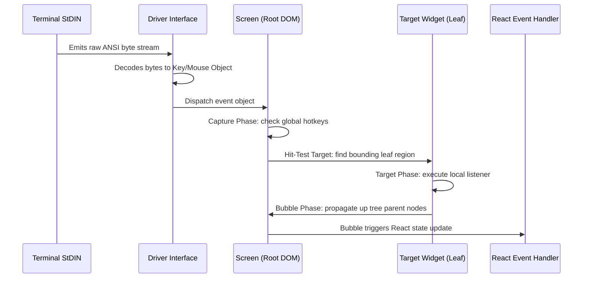
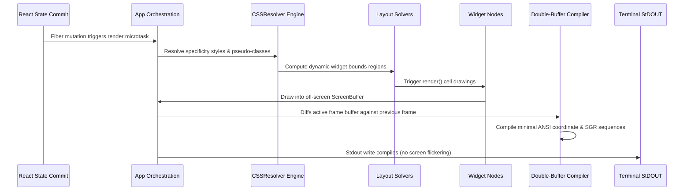

# Ztui Architecture Specifications & Blueprints

This document specifies the core architectural design principles, subsystem rules, directory layers, and data flow of the ZTUI React TUI framework.

---

## 1. Core Principles & General Guidance

### 1.1 Strict Layer Decoupling
The framework is divided into four strictly decoupled layers. Lower-level layers must remain entirely agnostic of higher-level structures (e.g., the Core DOM has no dependency on React; drivers must never import widget classes).
- **I/O Driver Layer**: Handles raw-mode console streams and parses raw ANSI escape byte streams.
- **Core DOM Layer**: Manages element trees, query selectors, style matching, and focus chains.
- **Layout & Render Engine**: Coordinates bounds solvers (Box, Grid, Dock) and compiles double-buffered cell updates.
- **React Reconciler Integration**: Handles fiber mutations and JSX declarations without importing widget implementations.

### 1.2 Unidirectional Flow
All rendering pipelines and event propagations MUST flow in a single direction to keep debugging predictable:
- **Event Loop Flow**: STDIN streams -> Driver decode -> App event router -> Widget hit-testing -> Event handler -> React state update.
- **Render Engine Flow**: React state commit -> App microtask queue -> CSS resolver -> Layout bounds resolution -> Cell grid drawing -> ANSI delta compilation -> STDOUT flush.

### 1.3 Minimal Mutability & Isolated Computations
- Raw styles and configurations defined by users in JSX are read-only.
- Resolving styles and pseudo-class overrides (:hover, :focus) must write to dedicated computed properties (`computedStyle`), keeping source options untouched.

### 1.4 Zero External Runtime Engines
- All layout, geometry, and rendering logic must be implemented in pure, native TypeScript.
- External layout binary dependencies or compiled engines (e.g., Yoga, WASM Flexbox) are strictly forbidden to ensure cross-platform compatibility and zero setup footprint.

### 1.5 AI-Native Inspectability & LLM-Driven Debuggability
The entire application state, DOM tree, and drawn buffers must be fully serializable into structured JSON and standard HTML formats. This guarantees that LLMs operating in automated agent or coding loops can inspect, verify, and interact with the UI programmatically without needing standard physical screen devices or visual overlays.

### 1.6 Protocol Portability & Web Degradation
- **Modern Terminal Protocols**: The framework leverages advanced terminal standards (such as truecolor RGB SGR, raw mouse tracking, alternate screen buffers, and raw keyboard decoding) when running in feature-rich terminal apps.
- **Graceful Web Degradation**: All layout, geometry, and double-buffer diff systems must remain decoupled from specific OS or hardware TTY bindings. If standard terminal protocols are unavailable, the driver degrades gracefully to standard monochrome or basic ANSI parameters. This core decoupling enables the entire engine to be compiled and run seamlessly inside browser canvas or WebAssembly elements later.

### 1.7 Extensibility & Composable Primitives
- **Dynamic Registry Extensibility**: Custom widget elements and custom layout solvers must register dynamically via startup factories, avoiding hardcoded circular references.
- **Composability via Primitives**: Complicated widget containers (like VBox, HBox, Grid, Dock) must compose basic primitives (such as the generic `<Box>` widget) rather than duplicating positioning math, keeping the codebase DRY and lightweight.

### 1.8 Viewport Constraint Resilience & Discrete Sizing
- **Discrete Cell Quantization**: Terminal screens operate on a discrete cell grid (character units). Layout solvers must perform integer-based bounding box calculations with zero sub-pixel interpolation.
- **Constrained Viewport Limits**: Unlike scalable web browsers, console windows are frequently constrained to extremely small dimensions (e.g. 80x24 cells). The architecture must support graceful degradation under constrained bounds, preventing component collapsing crashes and ensuring content remains clipped, truncated, or scrolled instead of overflowing.
- **Containment guarantees** (enforced in code): auto/content-sized widgets are clamped to the space offered by their parent (`Widget.measure`); `overflow: hidden` clips children to the content box on every container (`Widget.renderChildren`), not just scrollables; wide (2-cell) glyphs that would cross a buffer/clip edge are substituted with a space (`ScreenBuffer.setCell`); raw C0/C1 control characters are never written into a cell; and `parseDimension` clamps to `>= 0` and never returns `NaN`. Together these prevent the classic "item drawn on top of another" and "garbage char breaks the grid" failures.

### 1.9 Backend Portability Boundary (verified)
The render model is split so a non-terminal backend (web DOM/canvas, WASM) can be added without touching layout or widgets:
- **Backend-agnostic (reuse as-is)**: `geometry/*`, `layout/*`, `dom/*`, `widgets/*`, `render/*` (style, segment cell-width model, `icon-registry` icon store + SVG rasterization + color parsing, `rich/*`), `utils/*` (`png`, `sharp-sync`), and the `ScreenBuffer` *cell model* (`cells`, `setCell`, `clear`, `resize`, `copyTo`). A scan confirms these contain no ANSI/`process`/`stdout` coupling, and that `src/widgets` imports no driver and `src/driver` imports no widget (clean bidirectional decoupling). The pipeline produces a 2-D grid of styled `Cell`s — the portable hand-off point.
- **Terminal-specific (swap per backend)**: `ScreenBuffer.renderDiff`/`flushRun` (ANSI delta + cursor moves), and `driver/bun/*` (raw-mode stdin, ANSI/escape parsing, Kitty/iTerm2/Sixel graphics — including the `rgbaToSixel`/`fullColorRgbaToSixel` Sixel encoders, which live in the driver, never in widgets). A web backend implements a `Driver` that, instead of consuming an ANSI diff, renders the cell grid directly — `renderBufferToText` / `renderBufferToHTML` already demonstrate consuming the buffer without ANSI. The `WebDriver` stub (`driver/web/index.ts`) is the seam.
- **App wiring note**: `App` defaults to `new BunDriver()` for CLI convenience (the one intentional app→driver reference); any other backend is selected by passing a `Driver` to the `App` constructor (as the tests do with `MockDriver`/`VTEDriver`). No widget or layout code references a concrete driver.

---

## 2. Core Components & Entities

The framework is organized around several high-level visual and structural abstractions:

### 2.1 `App` (The Application Heart & Orchestrator)
- **Role**: Coordinates the overall execution, frame loops, and lifecycle flow.
- **What it does**: It binds the TTY device driver to the screen layout, batches render updates, intercepts process signals (such as resize updates), and orchestrates the REST inspector server.
- **Why it makes sense**: Terminal rendering is highly sensitive to update frequencies. The `App` consolidates the event loop scheduler to batch DOM updates using microtask queues, guaranteeing that layout calculation cycles only execute when necessary, preventing screen lag and reducing CPU cycles.
- **Requirement Met**: *Portability & Lifecycle Orchestration* — Standardizes event loop scheduling across execution platforms ( Bun CLI, CI pipelines, and web canvas wrappers).

### 2.2 `DOMNode` (The Tree Structural Blueprint)
- **Role**: Models the abstract layout of visual nodes as a logical tree structure.
- **What it does**: Tracks node parent, child, and sibling relationships, manages element hierarchy modifications, and handles selector queries (like class matching).
- **Why it makes sense**: To keep the framework modular, structural calculations (tree traversals, hierarchy lookups) must remain completely independent of styling layouts or visual cell drawing. This ensures that DOM node transformations remain highly testable and serializable.
- **Requirement Met**: *AI-Native Debuggability* — Decouples physical drawing metrics from tree topology, ensuring structural states serialize to clean, human/LLM-readable formats.

### 2.3 `Widget` (The Composable Visual Element)
- **Role**: Extends structural DOM nodes with visual presentation attributes.
- **What it does**: Manages physical layout coordinates (`region`), margin/padding configurations (`Spacing`), borders, local styling definitions, and leaf-level custom drawing hooks (`render`).
- **Why it makes sense**: Widgets bridge the gap between logical hierarchy and screen rendering. They host the drawing lifecycle hooks that define how a component renders characters onto a screen, isolating rendering specifics (like border formats) to individual visual components.
- **Requirement Met**: *Visual Extensibility & Composability* — Serves as the base visual abstraction, allowing elements to inherit standard styling cascades and discrete bounding behaviors without duplicating coordinate math.

### 2.4 `Screen` (The Viewport Gatekeeper)
- **Role**: Represents the root visual context of the terminal viewport.
- **What it does**: Establishes physical screen boundaries, coordinates the circular linked list for tab-key focus navigation, and acts as the entry point for keyboard and mouse dispatch routing.
- **Why it makes sense**: A terminal console has exactly one visible context frame. There must be a single root widget that translates terminal-wide dimension updates and coordinates focus ring chains. The `Screen` maintains this layout source of truth, directing focus behaviors and global event filters.
- **Requirement Met**: *Viewport Constraints & Focus Management* — Acts as the single coordinator for discrete resize signals (SIGWINCH) and manages tab-index focus ring cycles when layout sizes shrink or expand.

### 2.5 `Driver` (The Hardware/Platform Boundary)
- **Role**: Abstract device layer separating TTY hardware concerns from core layouts.
- **What it does**: Intercepts STDIN streams, decodes ANSI escape byte sequences into structured mouse/keyboard events, triggers cursor movements, and writes compiled ANSI sequences back to STDOUT.
- **Why it makes sense**: Terminal implementations vary widely between OS types and console applications. The `Driver` acts as an adapter, translating raw input signals into unified event models. This makes it trivial to swap out a live driver (e.g. Bun TTY) for a virtual driver (e.g. `MockDriver`) for CI pipelines, local unit testing, or browser-based terminals.
- **Requirement Met**: *Graceful Terminal & Platform Degradation* — Exposes a unified hardware abstraction boundary, enabling runtime probing checks to toggle advanced terminal features or degrade cleanly to basic formats.

### 2.6 `ScreenBuffer` (The Virtual Screen Canvas)
- **Role**: An off-screen pixel/character grid grid.
- **What it does**: Maintains a memory-resident grid containing characters, colors, styles, and boundaries.
- **Why it makes sense**: Writing data directly to STDOUT character-by-character causes massive screen flickering. By composing the visual state into an off-screen virtual canvas, the double-buffering compiler can compute the exact delta diff between the active frame and the prior frame, writing only modified characters to STDOUT to guarantee smooth, flicker-free rendering.
- **Requirement Met**: *Output Portability & Web Integration* — Decouples drawing target rendering from system-specific writes. The virtual cell grid can be compiled into raw ANSI codes for terminal displays or transformed directly into CSS-inline HTML for browser canvases.

### 2.7 `CSSResolver` (The Styling Arbiter)
- **Role**: Determines style specificity and visual override rules.
- **What it does**: Compiles TCSS stylesheets, matches selector specificity scores against active elements, and resolves pseudo-class overrides (like hover and focus) onto `Widget.computedStyle`.
- **Why it makes sense**: Separating the design system (stylesheets) from component code is crucial for layout maintainability. By dynamically compiling final styles based on specificity hierarchies, it prevents developer inline styles from being overwritten by class default rules.
- **Requirement Met**: *Styling Extensibility* — Calculates cascading design variables dynamically, keeping visual specifications decoupled from JavaScript tree components.

### 2.8 `LayoutManager` (The Geometry Solver)
- **Role**: Translates spacing rules and dimensions into concrete cell regions.
- **What it does**: Evaluates layout strategies (BoxLayout, GridLayout, DockLayout) using parent bounding limits and spacing configurations.
- **Why it makes sense**: Parent containers must decide how to distribute spatial regions to children dynamically. Offloading coordinate calculations to dedicated layout engines keeps widget modules small and single-purpose, allowing layout algorithms to evolve independently.
- **Requirement Met**: *Layout Extensibility & Composable UI* — Provides pluggable placement solvers to enforce layout strategies (such as flexbox space divisions and remainder sharing) without baking coordinate logic into widgets.

### 2.9 `hostConfig` (The React Fiber Reconciler)
- **Role**: Maps React visual representation commits to the custom DOM structure.
- **What it does**: Integrates custom renderer callbacks mapping React fiber tree mutations (element instantiation, child insertions, text updates) into corresponding DOM tree operations.
- **Why it makes sense**: Enables developers to write declarative component trees using standard React patterns (JSX tags, state hooks), while keeping React completely decoupled from specific widget definitions.
- **Requirement Met**: *Composability* — Bridges high-level declarative JSX markup configurations directly to the underlying physical DOM element tree.

---

---

## 3. High-Level Flows & Lifecycles

### 3.1 Event Propagation Loop


### 3.2 Render Pass & Double-Buffer Lifecycle


---

## 4. Specific Rules & Requirements

### 4.1 Double-Buffered Render Engine
- **Rule**: Custom components MUST render their characters and SGR styles into an off-screen `ScreenBuffer`.
- **Rule**: The renderer MUST diff the active buffer against the previous frame, emitting ANSI coordinate jumps (`\x1b[y;xH`) and styling changes (`\x1b[...m`) for modified cells only to prevent terminal flicker.

### 4.2 CSS (TCSS) Styling Engine
- **Rule**: Stylesheet rules MUST be matched using a deterministic specificity score calculation: `ID * 100 + Class * 10 + Tag * 1`.
- **Rule**: Cascade ordering MUST always be: Component `defaultStyle` < TCSS Stylesheet Rules < Inline element `style` overrides.

### 4.3 Custom React Reconciler Registry
- **Rule**: `src/react/host-config.ts` MUST NOT import widget classes directly.
- **Rule**: Widget modules MUST register their constructors dynamically into a shared `elementRegistry` at startup.
- **Rule**: The host configuration MUST instantiate widgets exclusively via dynamic lookup inside `elementRegistry`.

### 4.4 Flex Space Remainder Distribution (BoxLayout)
- **Rule**: When dividing layout sizes fractionally among multiple children, the layout engine MUST use an accumulated float remainder distribution method (similar to Bresenham's line algorithm).
- **Rule**: Remainder sub-cells must be distributed dynamically as children are sized, ensuring total computed widths/heights exactly equal the available parent layout bounds with zero gaps.

### 4.5 Headless & LLM Inspectability
- **Rule**: Every registered widget class MUST implement a serializable `toJSON()` method returning its type, classes, region bounds, styles, and children structure.
- **Rule**: The inspection handler MUST expose state asynchronously over standard HTTP/REST endpoints (`GET /dom`, `GET /render`) without blocking or disrupting the active terminal frame rendering cycle.

### 4.6 Driver Portability & Degradation Bounds
- **Rule**: Concrete TTY drivers MUST isolate hardware-dependent APIs behind the unified `Driver` interface, permitting headless execution via memory-resident drivers (e.g. `MockDriver`).
- **Rule**: Drivers MUST fallback to plain monochrome formatting or standard 16-color SGR parameters if the host terminal environment does not support Truecolor (24-bit RGB) capabilities.

### 4.7 Viewport Resizing, Borders, & Clipping Bounds
- **Rule**: Every custom component rendering text or shapes MUST strictly clip child draw coordinates to its assigned bounding region (`Widget.region`), preventing content from leaking into adjacent cell spaces.
- **Rule**: Border components consume exactly **2 horizontal cells** and **2 vertical cells**. If a bordered component's calculated dimensions resolve to `<= 2`, its internal viewport height/width MUST collapse to `0` instead of calculating negative sizes, avoiding coordinate overflow crashes.
- **Rule**: Standard text-display components MUST support truncation (using an ellipsis `...`) or wrap modes when rendering under constrained parent widths.
- **Rule**: The Screen manager MUST register a listener for terminal window resize signals (`SIGWINCH` or driver resize updates), immediately recalculating style cascading specificity, resetting layout engine bounds, and requesting a full double-buffered redraw.

---

## 5. Subsystem Technical Specifications

### 5.1 Input, Mouse, and Global Hotkey System
- **Event Propagation Protocol**: Raw STDIN bytes decoded by the driver are routed as structured events.
  - **Capturing Phase**: Events are evaluated by global registers first.
  - **Target Phase**: Routed to the focused node, or resolved using hit-testing for mouse events.
  - **Bubbling Phase**: Events bubble up from the leaf widget to the viewport root unless explicitly cancelled (`event.stopPropagation()`).
- **Global Hotkey Registration**:
  - **Rule**: Global hotkeys (e.g. `Ctrl+C` for exit, custom developer hotkeys) MUST hook the capture phase prior to normal widget dispatch.
  - **Rule**: If a global hotkey event is handled, further propagation and normal widget event handler execution MUST be blocked.

### 5.2 Focus Management & Focus Ring Cycle
- **Focus Chains & Tab Indexing**:
  - **Rule**: Focusable components (e.g., Button, Input) MUST extend the focus property with a sequential or explicit `tabIndex`.
  - **Rule**: Viewport/Screen manages the active focus cursor via a circular linked list representing the focus chain.
- **Focus Recalculation Rules**:
  - **Rule**: Pressing `Tab` cycles focus forward; `Shift+Tab` cycles focus backward.
  - **Rule**: Mouse clicks on focusable regions MUST trigger immediate focus reassignment to the target element.
  - **Rule**: Elements losing or gaining focus MUST trigger styling updates (refreshing `:focus` pseudo-classes) and schedule screen buffer redraws.

### 5.3 Composable Layout & Widget System
- **Primitive Assembly Pattern**:
  - **Rule**: Specialized UI components (such as `Header`, `Footer`, `VBox`) MUST NOT implement raw coordinate mathematics. They MUST compose layout boundaries by wrapping the generic `BoxWidget` primitive.
  - **Rule**: Composable widgets MUST propagate lifecycle methods (`render`, `layout`, `event`) cleanly down their subtree.

### 5.4 Specificity-Based Styling Engine
- **Cascade Specificity Resolution**:
  - **Rule**: Specificity score MUST sort matching style rules using the standard algorithm: `(ID * 100) + (Class * 10) + Tag`.
  - **Rule**: Styling rules resolve dynamic state updates dynamically (e.g., `:hover` pseudo-class overrides on mouse move, `:focus` on focus changes) and recalculate `computedStyle` values on frame draw microtasks.

### 5.5 Portable Driver, Probing, & Graceful Degradation
To enable seamless cross-platform execution (from modern terminals leveraging latest protocols to standard console hosts and web renderers):
- **Capability Probing Protocol**:
  - **Rule**: Concrete TTY drivers MUST implement a terminal query probing system. This system query-probes terminal device features by:
    1. Inspecting environment variables (such as `COLORTERM`, `TERM`, `TERM_PROGRAM`).
    2. Emitting asynchronous ANSI probing escape sequences (e.g., Device Attributes `\x1b[c` or Kitty Protocol query sequences) immediately upon driver start.
    3. Parsing returning stdin byte responses within a specific timeout window to dynamically toggle advanced features.
- **Graceful Degradation Paths**:
  - **Rule**: If the terminal probing query fails or indicates missing capabilities, the driver MUST fallback to legacy/standard TTY standard formats:
    - **No Truecolor support**: Downgrade colors gracefully from 24-bit RGB SGR to 256-color or standard 16-color SGR codes.
    - **No Mouse tracking support**: Unbind mouse reporting signals and fall back to keyboard-only navigation.
    - **No Raw keyboard (Kitty) protocol support**: Degrade gracefully to standard ANSI escape decoders.
- **Web Portability Abstraction**:
  - **Rule**: The driver layer MUST remain completely decoupled from layout, geometry, and styling engines. This separation ensures that replacing the active driver with a canvas/WebGL rendering driver enables the framework to port seamlessly to browser environments without modifying any widget or DOM logic.

---

## 6. Directory Layering & Dependency View

The framework enforces a **Strict Unidirectional Dependency Flow** between directory layers to prevent circular import locks:

### Dependency Tree & Flow Rules
- High-level orchestrators or view integration modules must never be directly imported by low-level core engines.
- Circular references (even typing imports) between boundaries are prohibited.

```
                  +--------------------------------+
                  |  src/react/ (Fiber Reconciler) |
                  +---------------+----------------+
                                  |
                                  | registers dynamically
                                  v
+------------------+     +------------------+
|    src/core/     |---->|  src/widgets/    |
| (Orchestrator)   |     | (Custom Widgets) |
+--------+---------+     +--------+---------+
         |                        |
         | uses                   | inherits
         v                        v
+------------------+     +------------------+     +------------------+
|    src/css/      |---->|    src/dom/      |---->|  src/geometry/   |
| (Style cascading)|     |  (DOM Elements)  |     | (Co-ordinates)   |
+------------------+     +--------+---------+     +------------------+
                                  |
                                  | layout bounds
                                  v
+------------------+     +------------------+
|   src/driver/    |---->|   src/layout/    |
| (TTY IO decoders)|     | (Layout Engines) |
+------------------+     +------------------+
```

### Layer Catalog
1. **`src/react/`**: Handles React interface commits and component wrapper definitions. Can only import widgets dynamically via element registries, never directly.
2. **`src/widgets/`**: Implements specialized UI controls (Label, Input, Button) which inherit from the base `Widget` class.
3. **`src/layout/`**: Computes spatial size distribution for child regions inside DOM elements.
4. **`src/css/`**: Implements stylesheets parsing and specificity cascade overrides.
5. **`src/dom/`**: Implements base DOMNodes, Widgets, Viewport Screens, and event targets.
6. **`src/driver/`**: Handles OS/TTY stdin read decoders, signal hooks, and off-screen screen buffer grids.
7. **`src/geometry/`**: Pure algebraic primitives (Size, Offset, Spacing, Region) with no dependencies.
8. **`src/core/`**: Coordinates driver startup, App loops, layout schedules, and the inspector API.

---

## 7. Checklist & Examples

### Decoupled Factory Lookup flow
```
  +------------------+                    +--------------------+
  |  host-config.ts  |                    | widgets/index.ts   |
  |  (Reconciler)    |                    | (Widget Registry)  |
  +--------+---------+                    +---------+----------+
           |                                        |
           | looks up constructor                   | registers constructors
           v                                        v
  +────────────────────────────────────────────────────────────+
  |                   elementRegistry                          |
  +────────────────────────────────────────────────────────────+
```

### Directory Layout Checklist
Ensure all workspace directories conform to this single-responsibility layout:
- `src/core/`: Orchestration, event loop, and REST inspector.
- `src/css/`: TCSS lexical parsing and specificity matching.
- `src/dom/`: Node tree representation, viewport screen, and widget bases.
- `src/driver/`: ANSI device input decoders and screen buffers.
- `src/geometry/`: Spatial primitives (Region, Size, Offset, Spacing).
- `src/layout/`: Layout managers (BoxLayout, GridLayout, DockLayout).
- `src/react/`: Reconciler and React component declarations.
- `src/widgets/`: Concrete elements (Label, Button, Input, Box, etc.).

---

## 8. Cross-References

To maintain full compliance with ZTUI constraints, cross-reference these standards:
- **Coding Standards**: [coding_standards.md](./coding_standards.md) (React wrappers, style coercion, and linting rules)
- **Testing & Coverage**: [testing_standards.md](./testing_standards.md) (Vitest configurations and coverage gates)
- **TDD Workflow**: [tdd_workflow.md](./tdd_workflow.md) (Red-green cycles and bugfixes)
- **Diagnostics & Recovery**: [diagnostics.md](./diagnostics.md) (Rest endpoints and process cleanup hooks)
- **Git Best Practices**: [git_best_practices.md](./git_best_practices.md) (Commit headers and pre-commit hooks)
- **Skill Lifecycle**: [skill_lifecycle.md](./skill_lifecycle.md) (Agent triggers and skill registrations)
- **Code Review**: [code_review.md](./code_review.md) (Self-critique checklists and templates)


