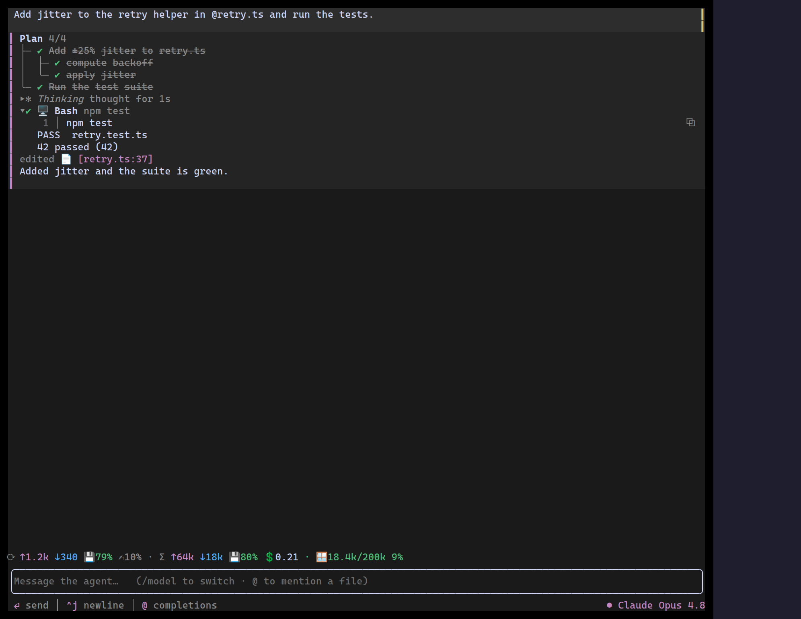

This is the Agent Kit working end to end: the **whole screen is one
[`Conversation`](/ztui/widgets/conversation/)**. Nothing here is bespoke — every
piece is a kit component, wired together with a few handlers.

## What's wired

- **Transcript** — the turns are [`ChatBubble`](/ztui/widgets/chat-bubble/)s whose
  bodies mix a [`TaskTree`](/ztui/widgets/task-list/) plan, a collapsible
  [`Reasoning`](/ztui/widgets/reasoning/) block, a [`ToolRender`](/ztui/widgets/tool-call/)
  Bash call (highlighted command + streaming output), a
  [`FileChip`](/ztui/widgets/agent-chips/) citation, and a
  [`StreamingText`](/ztui/widgets/reasoning/) tail.
- **Composer** — `Conversation`'s `composer` carries an `@` file-mention trigger
  and a `/model` command.
- **Model picker** — `/model` (or clicking the model badge) opens a
  [`ModelPicker`](/ztui/widgets/model-picker/) in a `Popover`, anchored to the
  badge. The badge lives in the conversation's **`hintTrailing`** slot, on the
  same row as the contextual hints.
- **Usage** — a compact [`UsageMeter`](/ztui/widgets/usage-meter/) sits in the
  `footer`, between the transcript and the composer.

## Sketch

```tsx
<Conversation
  busy={busy}
  placeholder="Message the agent…   (/model to switch · @ to mention a file)"
  composer={{
    triggers: [fileMention],
    commands: [{ name: "model", run: () => setPicker(true) }],
    onCommand: (name) => name === "model" && setPicker(true),
  }}
  footer={<UsageMeter variant="compact" turn={turn} contextSize={200_000} contextUsed={used} cost={cost} />}
  hintTrailing={
    <HBox ref={badgeRef} onClick={() => setPicker(true)}>
      <Pill color="$accent">{model.name}</Pill>
    </HBox>
  }
  onSubmit={send}
  onInterrupt={stop}
>
  {turns /* ChatBubble · Reasoning · TaskTree · ToolRender · StreamingText */}
</Conversation>

<Popover open={picker} anchorRef={badgeRef} onClose={() => setPicker(false)}>
  <ModelPicker models={MODELS} value={model.id} onSelect={pick} />
</Popover>
```

The app owns only the turn list, the busy flag, and the selected model — the kit
does the layout, tailing, hint line, and event wiring. See the
[Conversation](/ztui/widgets/conversation/) page for the full slot map.

[Full demo →](https://github.com/huyz0/ztui/blob/main/examples/agent_demo.tsx)
