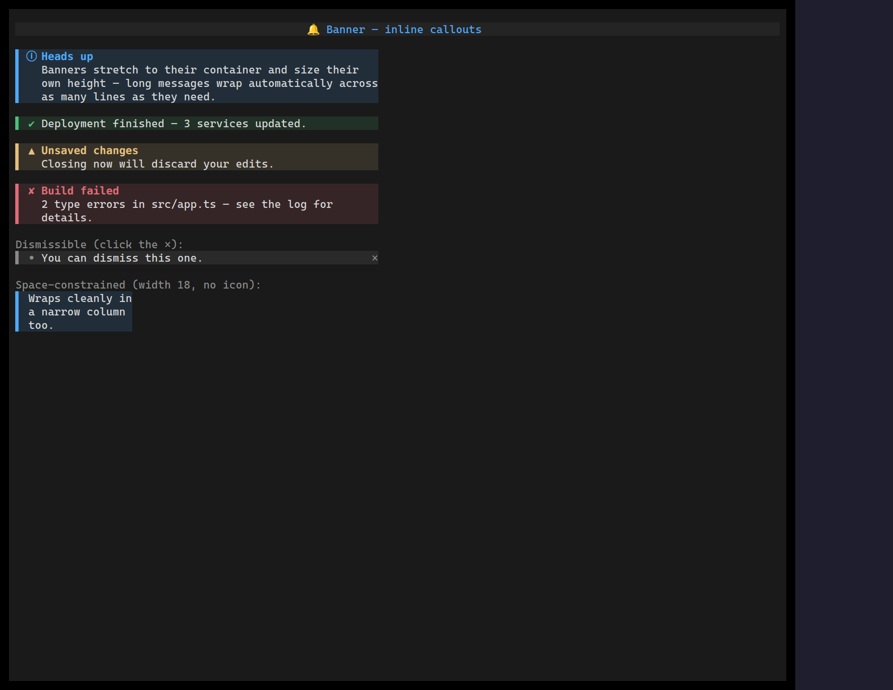

`<Banner>` is an inline callout — an accent rule, a variant icon, an optional
bold title and a word-wrapped message — for surfacing a state the user should
notice without it stealing focus or auto-dismissing like a toast. Five semantic
variants drive the icon and a theme-resolved accent together.

It stretches to its container width and sizes its own height from the wrapped
message, so it drops naturally into a column.

## Usage

```tsx
import { Banner } from "@huyz0/ztui/react";

<Banner
  variant="warning"
  title="Unsaved changes"
  message="Closing now will discard your edits."
/>;

// Dismissible
<Banner variant="success" message="Deployed." dismissible onDismiss={hide} />;
```

## Key props

- `variant` — `"info" | "success" | "warning" | "error" | "neutral"` (default `info`); sets the icon and accent.
- `title` — optional bold heading on the first line.
- `message` — body text; word-wraps to the available width.
- `glyphSet` — `"unicode" | "ascii" | "emoji"` icon vocabulary.
- `showIcon` / `fill` — toggle the leading icon and the tinted background (both default `true`).
- `dismissible` + `onDismiss` — draw a clickable `×` and fire on click.

The same callout look is produced automatically for [GitHub-Flavored Markdown
alerts](/widgets/markdown/#gfm-alerts) (`> [!NOTE]`, `> [!WARNING]`, …).

[Full demo →](https://github.com/huyz0/ztui/blob/main/examples/banner_demo.tsx)
