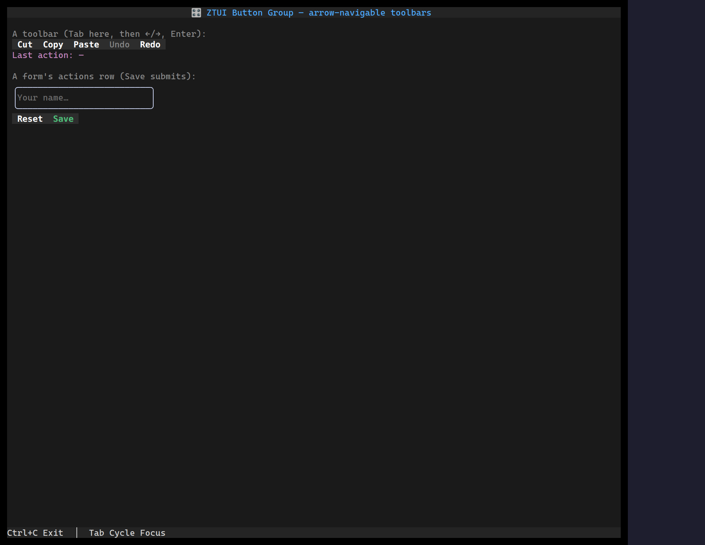

`<ButtonGroup>` turns a row of [`Button`](/ztui/widgets/button/)s into a
**roving-focus toolbar**: arrow keys (`←`/`→`/`↑`/`↓`, plus `Home`/`End`) move
focus between the buttons, and the whole group is a single **Tab** stop — so the
actions read as one control instead of N separate tab stops. Disabled buttons are
skipped.

Each child is a real `Button`, so it keeps its own `onClick`, focus glow, and
`formAction` — the group only owns navigation. That means a group of `formAction`
buttons dropped into a [`Form`](/ztui/widgets/form/) is an arrow-navigable
actions row that still submits or resets the form on Enter.

## Usage

```tsx
import { Button, ButtonGroup } from "@huyz0/ztui/react";

<ButtonGroup>
  <Button onClick={cut}>Cut</Button>
  <Button onClick={copy}>Copy</Button>
  <Button onClick={paste}>Paste</Button>
  <Button disabled>Undo</Button>
  <Button onClick={redo}>Redo</Button>
</ButtonGroup>;
```

### Inside a form

```tsx
<Form onSubmit={save}>
  <Input id="name" />
  <ButtonGroup>
    <Button formAction="reset">Reset</Button>
    <Button formAction="submit" style={{ color: "$success" }}>Save</Button>
  </ButtonGroup>
</Form>
```

Tab moves through the fields, lands on the group as one stop, `←/→` pick the
action, and Enter on **Save** submits (validating the form first) — no extra
wiring.

## Key props

- `children` — the `Button`s to navigate between.
- `orientation` — `"horizontal"` (default) or `"vertical"`; sets the layout
  direction. Arrows work on both axes regardless, matching a radio group.
- `wrap` — wrap around at the ends instead of stopping (default `true`).

## How it works

The group is not itself a focus target — each frame it leaves only the **active**
button `focusable`, so the screen's tab order has exactly one entry for the group.
Arrow keys arrive by bubbling up from the focused button (whose own key handler
ignores them) and move focus to the previous/next enabled button. This mirrors
the [`RadioGroup`](/ztui/widgets/radio-group/) roving-selection model, but over
real buttons so activation, theming, and form behaviour stay native.
