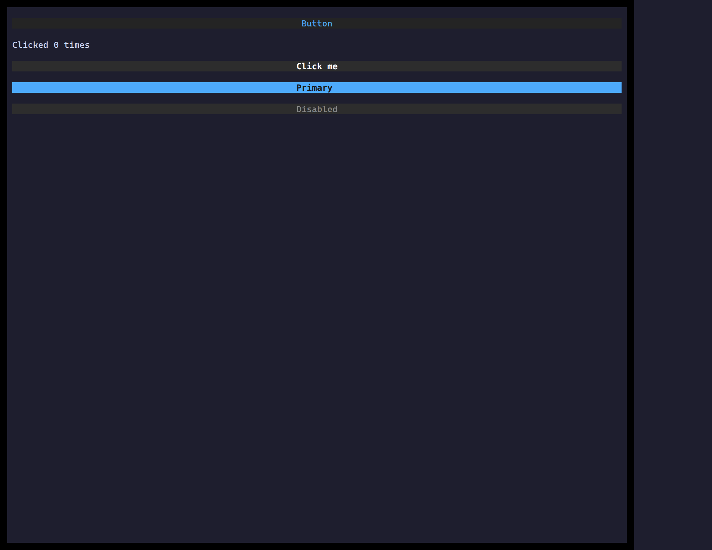

`<Button>` is a focusable control that fires `onClick` on `Enter`/`Space` or a
mouse click. Style it like any widget; pair it with a `Form` via `formAction`.

## Usage

```tsx
import { useState } from "react";
import { Button } from "@huyz0/ztui/react";

function Counter() {
  const [n, setN] = useState(0);
  return (
    <Button onClick={() => setN(n + 1)} style={{ background: "$primary", color: "$background" }}>
      Clicked {n}×
    </Button>
  );
}
```

## Key props

- `onClick` — fired on click or `Enter`/`Space` when focused.
- `formAction` — `"submit"` | `"reset"` to drive an enclosing [Form](/ztui/widgets/form/).
- `disabled` — inert + muted styling.

[Full demo →](https://github.com/huyz0/ztui/blob/main/examples/button_demo.tsx)
