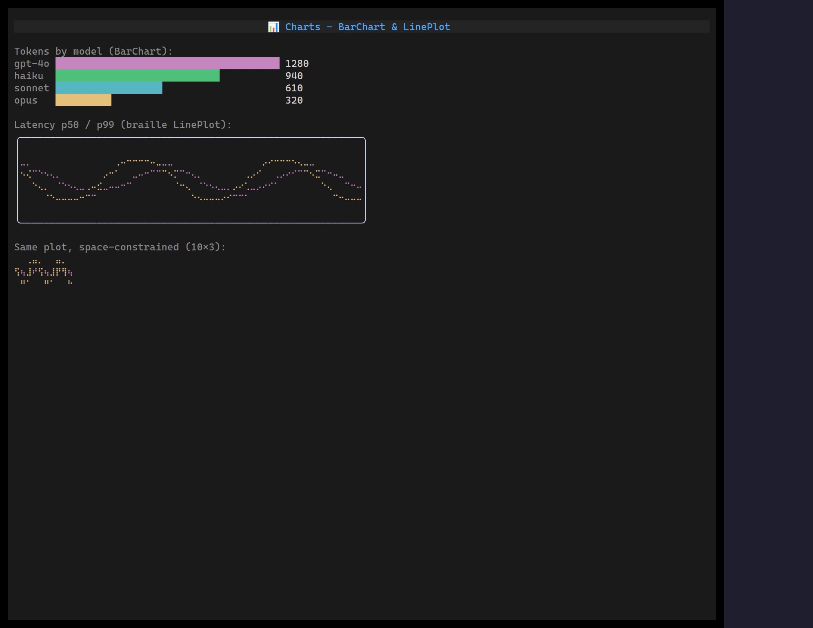

The chart family adds two compact data-viz widgets that sit above
[Sparkline](/widgets/sparkline/) when you need labels, multiple series, or more
fidelity. Both are constraint-resilient — they fill whatever box they're given,
down to a single cell.

## BarChart

`<BarChart>` draws one horizontal bar per item for comparing labelled
magnitudes (top routes, model usage, error counts), with eighth-block sub-cell
precision.

```tsx
import { BarChart } from "@huyz0/ztui/react";

<BarChart
  items={[
    { label: "gpt-4o", value: 1280, color: "$accent" },
    { label: "haiku", value: 940, color: "$success" },
    { label: "opus", value: 320, color: "$warning" },
  ]}
  style={{ width: 50, height: 4 }}
/>;
```

- `items` — `{ label?, value, color? }[]`.
- `min` / `max` — fix the scale (defaults `0` → the largest value).
- `showValue` — print each value after its bar (dropped first when space is tight).

When the width tightens it sheds the value column, then truncates labels, always
keeping at least the bar.

## LinePlot

`<LinePlot>` plots one or more numeric series as connected braille lines — each
cell is a 2×4 dot grid, so a `cols×rows` box yields a `(cols·2)×(rows·4)`
plotting surface.

```tsx
import { LinePlot } from "@huyz0/ztui/react";

<LinePlot
  series={[latencyP50, latencyP99]}
  colors={["$accent", "$warning"]}
  min={0}
  max={100}
  style={{ border: "rounded", width: 60, height: 8 }}
/>;
```

- `data` — a single series, or `series` — multiple `number[][]`.
- `colors` — per-series colours (cycles if shorter than the series count).
- `min` / `max` — fix the value range (defaults to the data's own range).

It copes with empty, single-point, and flat series without dividing by zero or
drawing out of bounds.

[Full demo →](https://github.com/huyz0/ztui/blob/main/examples/chart_demo.tsx)
