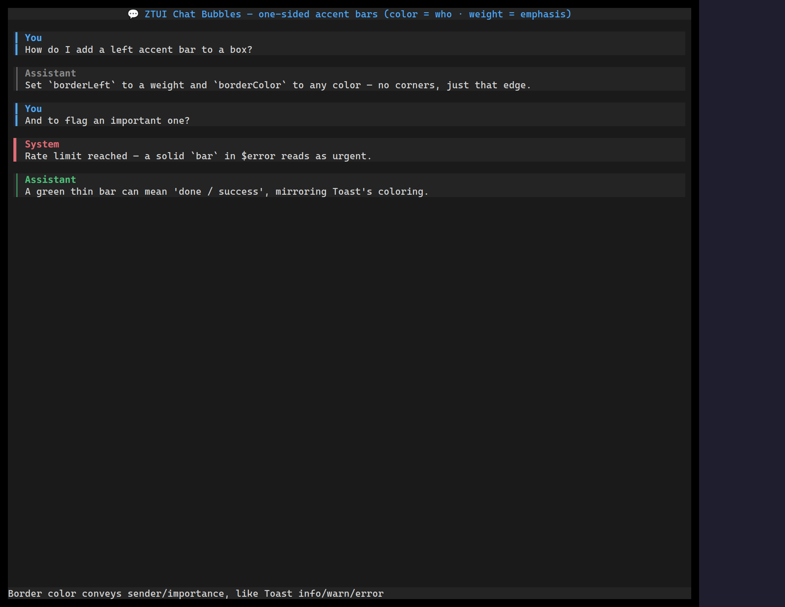

`<ChatBubble>` is a transcript message: a **one-sided accent bar** (its colour
says who is speaking), an optional author header, and the message body. Roles
supply sensible defaults — the human prompt gets a warm bar on the **right**, the
assistant a cool bar on the **left**, tool output a muted bar — and every facet
is overridable, so it stays a generic primitive rather than a fixed four-role
widget.

The bar's **colour encodes the sender** and its **weight encodes emphasis**, so
turns read apart without spending blank rows between them.

## Usage

```tsx
import { ChatBubble, Markdown } from "@huyz0/ztui/react";

<ChatBubble role="user">Run the tests and clean the build dir.</ChatBubble>

<ChatBubble role="assistant">
  <Markdown trimTrailingMargin>On it — running the **suite** now.</Markdown>
</ChatBubble>

<ChatBubble role="tool" accent={{ color: "#8a8a8a" }}>
  <ToolRender call={{ name: "Bash", args: "npm test", status: "success" }} />
</ChatBubble>
```

A plain string child is wrapped in a word-wrapping label for you, so
`<ChatBubble>text</ChatBubble>` just works; pass `Markdown` (or any nodes) for
rich bodies.

## Key props

- `role` — `"user"` / `"assistant"` / `"tool"` / `"system"`. Selects the default
  accent (colour, side, weight) and the per-role background tint.
- `accent` — override any facet of the role's accent: `{ color, side, weight }`,
  where `side` is `"left"`/`"right"` and `weight` is `"thin"`/`"heavy"`/`"bar"`.
  e.g. `accent={{ color: "#7db4ff" }}` for a literal light-blue bar.
- `background` — bubble fill; defaults to the role's tint, `null` for none.
- `author` / `icon` — optional bold author label (in the accent colour) with a
  leading icon. Omit them (the default) to let the bar and tint carry the sender.

## Roles and accents

The role → accent mapping lives in `DEFAULT_ROLE_ACCENTS` (all theme tokens, so
the bars track the active palette). Because every facet is overridable, you can
define new roles by spreading an accent override rather than being limited to the
four built-ins — pass `resolveAccent(role, override)` semantics straight through
the `accent` prop.

[Full demo →](https://github.com/huyz0/ztui/blob/main/examples/chat_bubbles_demo.tsx)
