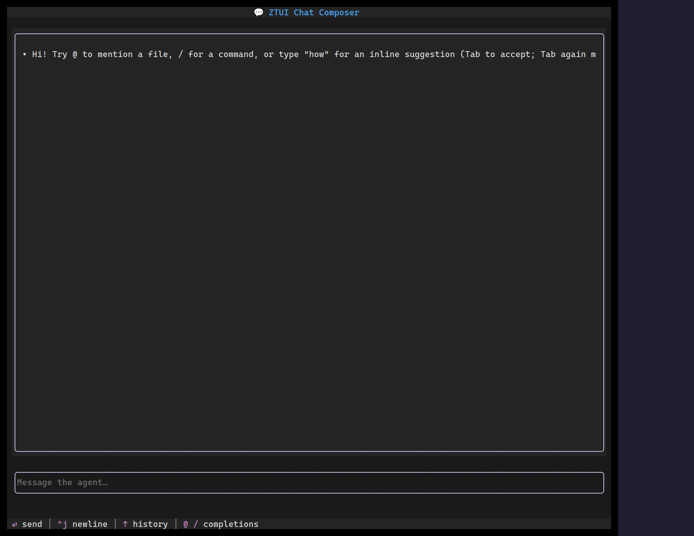

`<ChatInput>` is a chat composer built for AI-agent interfaces. It owns its own
edit buffer (so it works with any state-management approach, not just React),
auto-grows with content, and sends on Enter (Shift+Enter inserts a newline). On
top of plain text it adds atomic inline **chips**, character-triggered
**completions**, app-provided **ghost-text autocomplete**, **history recall**,
undo/redo, an attachment strip, and an in-border **send/stop** affordance driven
by a `busy` flag.

## Usage

```tsx
import { useRef, useState } from "react";
import { ChatInput } from "@huyz0/ztui/react";
import type { Completion, Trigger } from "@huyz0/ztui/react";

function Composer() {
  const [busy, setBusy] = useState(false);
  const history = useRef<string[]>([]);

  const mention: Trigger = {
    char: "@",
    getCompletions: (q) =>
      files.filter((f) => f.includes(q)).map((f): Completion => ({ label: f, detail: "file" })),
    onAccept: (c) => ({ kind: "chip", token: { label: c.label, kind: "file", payload: c.label } }),
  };

  return (
    <ChatInput
      placeholder="Message the agent…"
      busy={busy}
      triggers={[mention]}
      getHistory={() => history.current}
      onSubmit={(value, attachments) => {
        history.current.push(value);
        setBusy(true);
        // …kick off the agent turn, clear busy when it replies
      }}
      onInterrupt={() => setBusy(false)}
    />
  );
}
```

## Key props

- `value` / `onChange` — controlled text (setting `value` does not re-emit `onChange`).
- `placeholder` — hint shown when empty.
- `busy` / `onInterrupt` — show the in-border stop affordance while the agent
  generates; Esc or the stop glyph calls `onInterrupt`.
- `onSubmit(value, attachments)` — called when the user sends a turn.
- `submitMode` — `"enter"` (default) or `"modifier-enter"` (Mod+Enter sends).
- `triggers` — character-triggered completion sources (e.g. `/` commands,
  `@` mentions). Each resolves to inserted text, an atomic chip, or a command.
- `commands` — keybinding/palette commands surfaced through the composer.
- `suggestionProvider` — app-provided inline ghost-text autocomplete (a dim
  suffix with a `→` marker); accept key set by `acceptSuggestionKey`
  (`"right"` default, `"tab"`, or `"ctrl-e"`).
- `getHistory` / `historyEdge` — Up/Down history recall; `"bump"` (default) only
  recalls at the true buffer start/end, `"row"` recalls anywhere on the
  first/last row.
- `minRows` / `maxRows` / `softWrap` — auto-grow bounds and wrapping.
- `chipStyle` — `"fill"` or `"bracket"` chip rendering.
- `onHintsChange` — emits the contextual `ChatHint[]`; render it as a help line
  (see `formatChatHints`).

## Triggers and chips

A `Trigger` turns a character (like `/` or `@`) into a completion popup, and
its `onAccept` decides what the accepted item becomes — plain text, an atomic
**chip** (selected, deleted, and caret-skipped as one unit), or a **command**.
This keeps slash-commands and @mentions as data rather than hardcoded paths.
`serialize` controls how a chip flattens into the submitted string.

Selection, clipboard (mouse drag, Shift+Arrow, Ctrl+A), and copy/paste behave
consistently with [`Input`](/widgets/input/) and [`Text Area`](/widgets/text-area/).

[Full demo →](https://github.com/huyz0/ztui/blob/main/examples/chat_demo.tsx)
