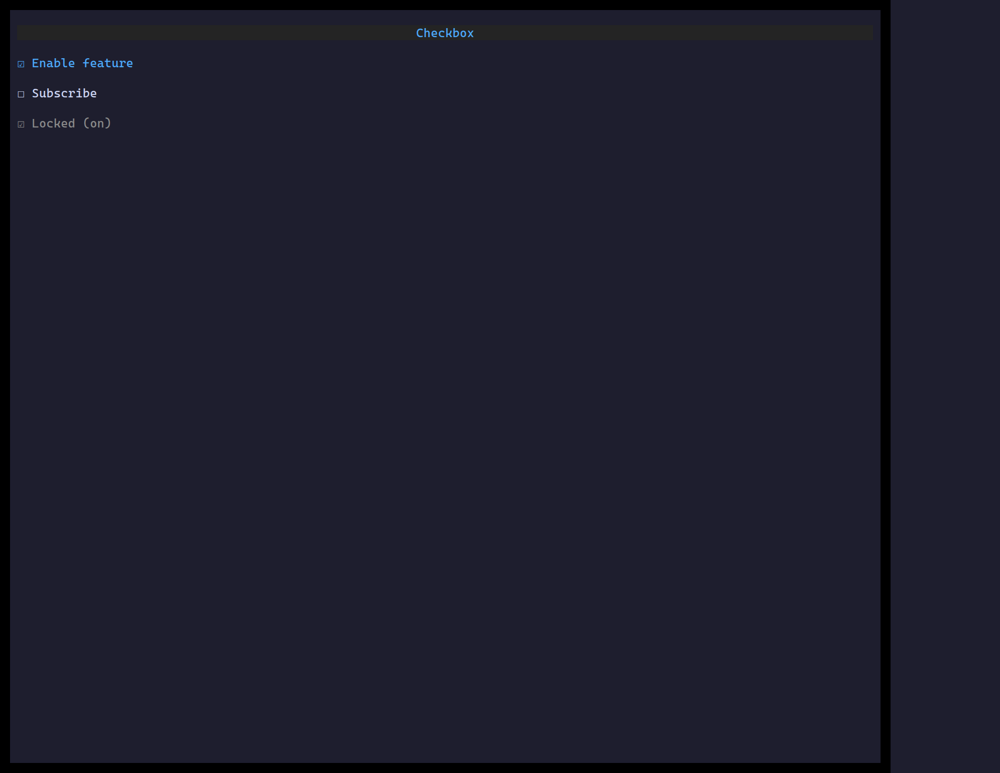

`<Checkbox>` toggles a boolean on `Space`/`Enter` or click, with an optional label.

## Usage

```tsx
import { useState } from "react";
import { Checkbox } from "@huyz0/ztui/react";

function Toggle() {
  const [on, setOn] = useState(false);
  return <Checkbox checked={on} onChange={setOn} label="Enable feature" />;
}
```

## Key props

- `checked` / `onChange` — controlled boolean.
- `label` — text shown beside the box.
- `disabled` — inert + muted.
- `validators` / `validateOn` / `onValidate` — validation in a [Form](/ztui/widgets/form/).

[Full demo →](https://github.com/huyz0/ztui/blob/main/examples/checkbox_demo.tsx)
