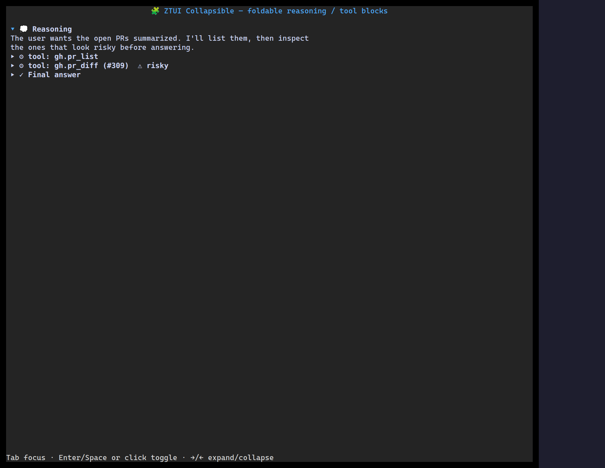

`<Collapsible>` is a titled disclosure: a clickable header with a chevron that
shows or hides its children. Controlled or uncontrolled.

## Usage

```tsx
import { Collapsible, Label } from "@huyz0/ztui/react";

<Collapsible title="Tool call" defaultOpen>
  <Label>The body is revealed when the section is open.</Label>
</Collapsible>;
```

## Key props

- `title` — the header text.
- `open` / `defaultOpen` — controlled or initial state.
- `onToggle` — fired with the new open state.
- `glyphSet` — customize the open/closed marker glyphs.

[Full demo →](https://github.com/huyz0/ztui/blob/main/examples/collapsible_demo.tsx)
