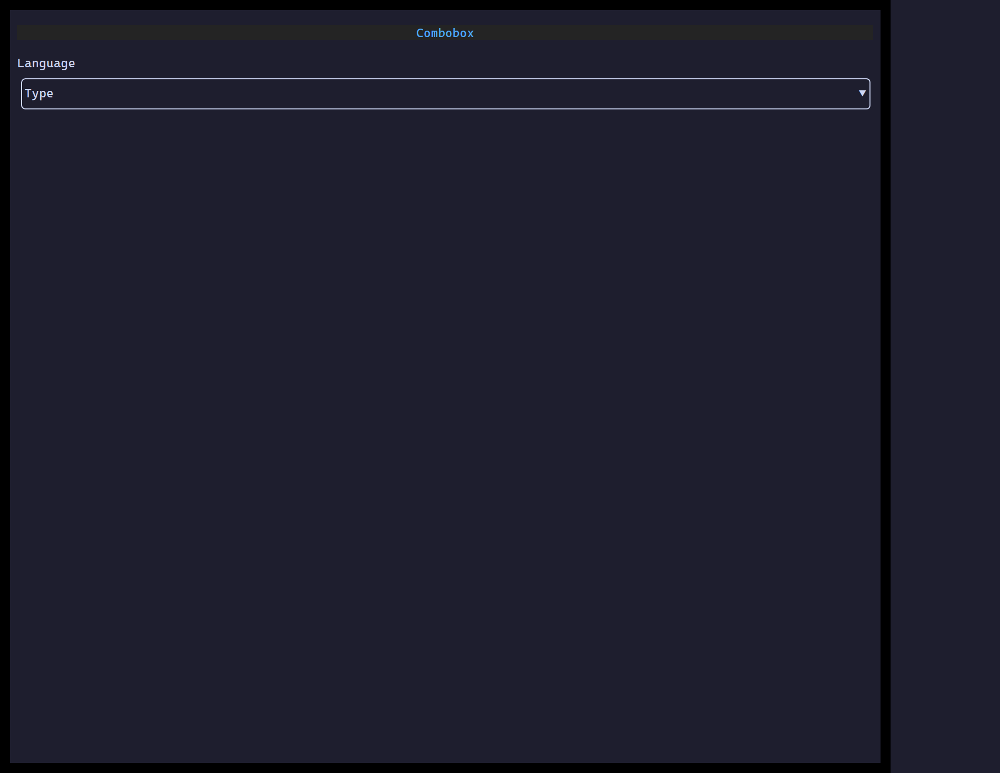

`<Combobox>` is a text field that narrows `options` to matches as you type,
showing suggestions in a popover — pick one, or keep typing a custom value.

## Usage

```tsx
import { useState } from "react";
import { Combobox } from "@huyz0/ztui/react";

function LangPicker() {
  const [lang, setLang] = useState("");
  return (
    <Combobox
      options={["TypeScript", "Rust", "Go", "Python"]}
      value={lang}
      onChange={setLang}
      placeholder="Type to filter…"
    />
  );
}
```

## Key props

- `options` — `(string | { value, label })[]`.
- `value` / `onChange` — the current text, updated on every edit and pick.
- `onSelect` — fired specifically when a suggestion is picked (click or Enter).
- `placeholder` — shown when the field is empty.
- `allowCustomValue` — keep text matching no option as-is when the popover
  closes (default `true`); set `false` to require picking a listed option.

## Interaction

Typing filters and opens the popover · `↑`/`↓` move the highlighted suggestion
· `Enter` picks it · `Escape` closes without picking · click a suggestion to
pick it.

[Full demo →](https://github.com/huyz0/ztui/blob/main/examples/combobox_demo.tsx)
