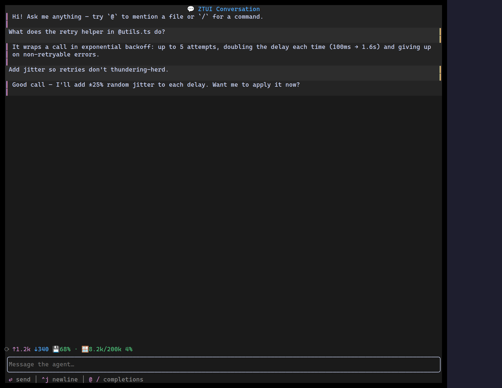

`<Conversation>` is the shell that ties the Agent Kit together: a tail-following
[`Transcript`](#transcript) of turns (its children) with a docked
[`ChatInput`](/ztui/widgets/chat-input/) composer beneath them. It owns the
layout and the **submit / interrupt / busy / hint-line** wiring, so your app
only supplies the turns and a few handlers — no manual hint state, spacer rows,
or scroll plumbing.

It is **stateless by design**: your app keeps the message list and the `busy`
flag; `Conversation` just lays them out and routes events. That mirrors how
`ChatInput` owns only its draft buffer, and keeps the component compatible with
any state-management approach.

## Usage

```tsx
import { useState } from "react";
import { ChatBubble, Conversation, UsageMeter } from "@huyz0/ztui/react";

function Agent() {
  const [turns, setTurns] = useState<{ id: number; role: "user" | "assistant"; text: string }[]>([]);
  const [busy, setBusy] = useState(false);

  return (
    <Conversation
      busy={busy}
      placeholder="Message the agent…"
      composer={{ triggers: [mention, slash] }}
      footer={<UsageMeter variant="compact" turn={turn} contextSize={200_000} contextUsed={used} />}
      onSubmit={(text) => {
        setTurns((t) => [...t, { id: next(), role: "user", text }]);
        setBusy(true); // …kick off the turn, append the reply, clear busy
      }}
      onInterrupt={() => setBusy(false)}
    >
      {turns.map((t) => (
        <ChatBubble key={t.id} role={t.role}>
          {t.text}
        </ChatBubble>
      ))}
    </Conversation>
  );
}
```

## Key props

- `children` — the turns, rendered inside the transcript ([`ChatBubble`](/ztui/widgets/chat-bubble/),
  [`ToolRender`](/ztui/widgets/tool-call/), [`Reasoning`](/ztui/widgets/reasoning/), anything).
- `busy` / `onInterrupt` — drive the composer's in-border stop affordance; Esc or
  the stop glyph calls `onInterrupt`.
- `onSubmit(value, attachments)` — called when the user sends a turn.
- `placeholder` — composer placeholder.
- `composer` — the long tail of [`ChatInput`](/ztui/widgets/chat-input/) props
  (triggers, commands, history, ghost-text suggestions, chip serialization). The
  top-level `placeholder`/`busy`/`onSubmit`/`onInterrupt` win over the same keys here.
- `header` / `footer` — optional regions above the transcript and between the
  transcript and the composer (e.g. a title bar and a [`UsageMeter`](/ztui/widgets/usage-meter/)).
- `followTail` — pin to the newest turn until the user scrolls up (default `true`).
- `readOnly` — hide the composer for an archived, read-only transcript view.
- `showHints` / `extraHints` — auto-render the composer's contextual hint line
  (on by default); `Conversation` tracks the hints itself.
- `hintLeading` / `hintTrailing` — slots on the **same row** as the hint line,
  pinned left and right of the auto hints (a `1fr` spacer pushes the trailing one
  to the edge). Use them for a status glyph or connection `Pill` on the left and
  a model badge, [`UsageMeter`](/ztui/widgets/usage-meter/), or token-rate
  readout on the right.

## Slots

`Conversation` is a composition shell — every region is a slot you fill:

| Slot | Where | Typical content |
|------|-------|-----------------|
| `header` | above the transcript | title bar, a model/mode picker |
| `children` | the transcript | `ChatBubble` / `ToolRender` / `Reasoning` turns |
| `footer` | between transcript and composer | a `UsageMeter`, a status `HBox` |
| `composer` | the docked `ChatInput` | triggers, commands, history, suggestions |
| `hintLeading` / `hintTrailing` | the hint row (bottom) | status glyph · model badge / metrics |

The `footer` and the two `hint*` slots take arbitrary nodes, so a left/right
split is just an `HBox` with a `width: "1fr"` spacer between the two sides.

## Transcript

`<Transcript>` is the scrollback on its own: a vertical, **tail-following**
scroll region that pins to the latest turn as content streams in, until the user
scrolls up to read history (and re-pins when they return to the bottom). It is
vertical-scroll only, so long messages word-wrap to the viewport instead of
overflowing. `Conversation` renders one internally, but you can use it directly
for a custom layout.

```tsx
<Transcript style={{ height: "1fr" }}>
  <ChatBubble role="user">…</ChatBubble>
  <ChatBubble role="assistant">…</ChatBubble>
</Transcript>
```

[Full demo →](https://github.com/huyz0/ztui/blob/main/examples/conversation_demo.tsx)
