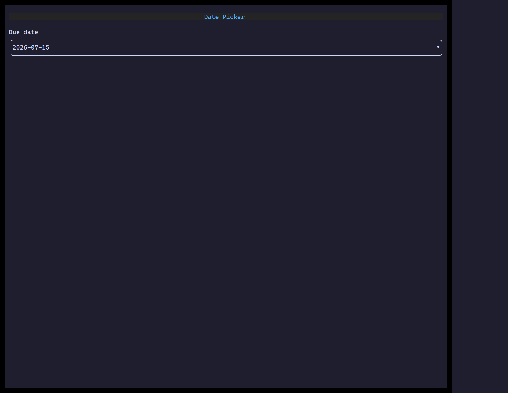

`<DatePicker>` is a single-date field — activate it (click, Enter, or Space)
to open a calendar popover, navigate by day/month/year, and commit a pick.
The value is always a plain `YYYY-MM-DD` string.

## Usage

```tsx
import { useState } from "react";
import { DatePicker } from "@huyz0/ztui/react";

function DueDate() {
  const [date, setDate] = useState("");
  return <DatePicker value={date} onChange={setDate} placeholder="Pick a date…" />;
}
```

## Key props

- `value` — selected date as `YYYY-MM-DD`, or `""`/omitted for no selection.
- `onChange` — called with the new `YYYY-MM-DD` value when a day is committed.
- `placeholder` — shown when nothing is selected.

## Interaction

`Enter`/`Space`/click opens the calendar popover · arrow keys move the focused
day · `PageUp`/`PageDown` step months · `Enter` commits the focused day ·
`Escape` closes without committing.

[Full demo →](https://github.com/huyz0/ztui/blob/main/examples/date_picker_demo.tsx)
