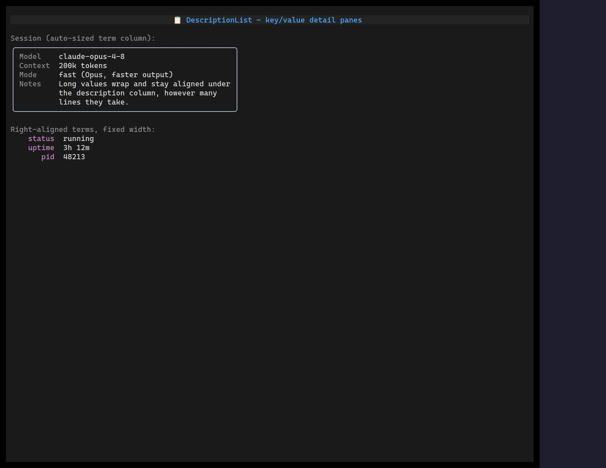

`<DescriptionList>` is a two-column `term : description` list — the terminal
analogue of an HTML `<dl>` — for config dumps, key/value detail panes, and
metadata summaries. Terms share one auto-sized (or fixed) left column;
descriptions fill the rest and word-wrap, with continuation lines aligned under
the description column.

## Usage

```tsx
import { DescriptionList } from "@huyz0/ztui/react";

<DescriptionList
  items={[
    { term: "Model", description: "claude-opus-4-8" },
    { term: "Context", description: "200k tokens" },
    { term: "Notes", description: "Long values wrap and stay aligned." },
  ]}
/>;
```

## Key props

- `items` — `{ term, description }[]`, the rows.
- `termWidth` — fix the term-column width; when unset it auto-sizes to the widest term (capped at 24).
- `gap` — cells between the columns (default 2).
- `termAlign` — `"left" | "right"` (default `left`).
- `termColor` — term colour (default `$dimmed`); the value uses `style.color` (default `$foreground`).

It caps and truncates the term, wraps the description to whatever width remains,
and clips rows that don't fit.

[Full demo →](https://github.com/huyz0/ztui/blob/main/examples/description_list_demo.tsx)
