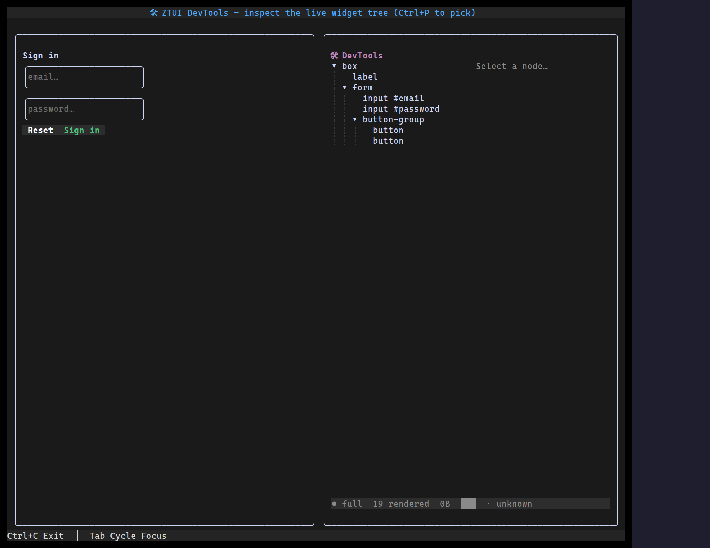

`<DevTools>` is an in-app inspector — a React-DevTools analogue for ztui. The
left pane is the **live widget tree** (`tag #id .class`); selecting a node shows
its **geometry, flags, and resolved style** on the right and **boxes it on
screen** with a `<DevToolsHighlight>` overlay; the footer is a one-line **render
profiler** (scoped vs full frame, widgets rendered, bytes emitted, and the
reasons the last frame ran). In **pick mode** (`pick`), hovering the app selects
the widget under the pointer — point at the UI to inspect it. Read-only.

## Usage

Point it at a **different** subtree than itself — pass the inspected app's root
via a `ref` — so it doesn't inspect its own widgets:

```tsx
import { useEffect, useRef, useState } from "react";
import { App, type Widget } from "@huyz0/ztui";
import { DevTools, type DevToolsFrame } from "@huyz0/ztui/react";

function WithDevTools() {
  const inspected = useRef<Widget>(null);
  const [frame, setFrame] = useState<DevToolsFrame | null>(null);
  useEffect(() => {
    const h = setInterval(() => setFrame(App.instance?.getLastFrame() ?? null), 400);
    return () => clearInterval(h);
  }, []);

  return (
    <HBox>
      <VBox ref={inspected} style={{ width: "1fr" }}>{/* your app */}</VBox>
      <DevTools root={inspected.current} frame={frame} style={{ width: "1fr" }} />
    </HBox>
  );
}
```

## Key props

- `root` — the widget to inspect (the inspected app's container, or the screen).
- `frame` — the latest `App.getLastFrame()` summary; drives the profiler strip
  (`full`, `widgetsRendered`, `bytes`, `reasons`).
- `refreshMs` — how often to re-read the live (mutating) tree. Default `400`.
- `pick` — pick mode: track `App.instance.hoveredWidget` and select it (hover the
  app to inspect). Off by default.
- `onInspect(region | null)` — fired when the selection changes, with its screen
  rect; render a `<DevToolsHighlight region={…} />` (under a full-screen root, so
  it isn't clipped to a panel) to draw the highlight box over the widget.

## Data layer

The panel is built on a small in-process data layer you can use directly (e.g.
to build your own inspector or a remote panel):

- `serializeDevTree(root)` → a `Tree`-compatible `DevToolsNode` (path ids,
  text nodes omitted).
- `resolveDevNode(root, id)` → the live node for a tree id.
- `widgetDetail(node)` → `{ term, description }[]` of identity, geometry, flags,
  and resolved style.

This complements the HTTP `startInspector()` backend (`/tree`, `/dom`, `/state`,
`/render`, `/screenshot`).

## Browser panel

`startInspector(app)` also serves a **browser DevTools panel** at
`GET /devtools` — open it in any browser pointed at the inspector:

```ts
import { startInspector } from "@huyz0/ztui";

const server = startInspector(app); // http://127.0.0.1:8000
// → open http://127.0.0.1:8000/devtools
```

It's a self-contained page (no build step) that polls `/render`, `/dom`, and
`/state` and shows a **live screen mirror**, the **interactive widget tree**, a
**per-node detail** pane, and a **state/profiler header** (focus, hover, theme,
top render reasons). Clicking a node boxes it on the mirror. The inspector binds
to loopback by default — it has no auth and `POST /input` can drive the app, so
only expose it on a trusted network.

[Full demo →](https://github.com/huyz0/ztui/blob/main/examples/devtools_demo.tsx)
