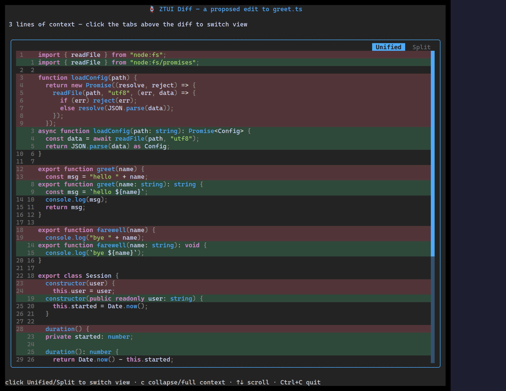

`<Diff>` compares two texts and renders the changes, either unified (one column)
or split (side-by-side), with optional syntax highlighting and line numbers.

## Usage

```tsx
import { Diff } from "ztui/react";

<Diff
  oldText={"function add(a, b) {\n  return a - b;\n}"}
  newText={"function add(a, b) {\n  return a + b;\n}"}
  language="typescript"
  defaultView="unified"
  lineNumbers
/>;
```

## Key props

- `oldText` / `newText` — the two sides to compare.
- `language` — syntax-highlight the body (needs `ztui/syntax` + `prismjs`).
- `view` / `defaultView` / `onViewChange` — `"unified"` or `"split"`.
- `showToggle` · `lineNumbers` · `context` (lines of context around changes).

[Full demo →](https://github.com/huyz0/ztui/blob/main/examples/diff_demo.tsx)
