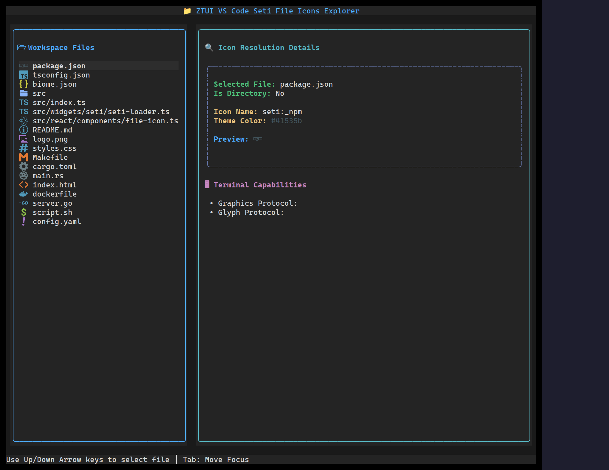

`<FileIcon>` resolves a filename (or extension/language) to its
[Seti](https://github.com/jesseweed/seti-ui) file-type icon and per-type color —
the same icon set VS Code uses. The glyph is extracted from the Seti font and
rendered as a crisp vector (natively on the web/canvas backend).

## Usage

```tsx
import { FileIcon, HBox, Label } from "@huyz0/ztui/react";

<HBox>
  <FileIcon filename="package.json" />
  <Label> package.json</Label>
</HBox>

<FileIcon filename="src" isFolder />
<FileIcon extension="rs" />
<FileIcon languageId="typescript" />
```

## Key props

- `filename` — resolve the icon (and color) from the full name.
- `extension` — resolve from an extension when you don't have a full name.
- `languageId` — resolve from a language id (e.g. `"typescript"`).
- `isFolder` — render the folder icon instead.

:::note
Seti glyphs are parsed from a bundled WOFF font with an optional `opentype.js`;
without it, file icons fall back to a Unicode glyph.
:::

[Full demo →](https://github.com/huyz0/ztui/blob/main/examples/fileicon_demo.tsx)
