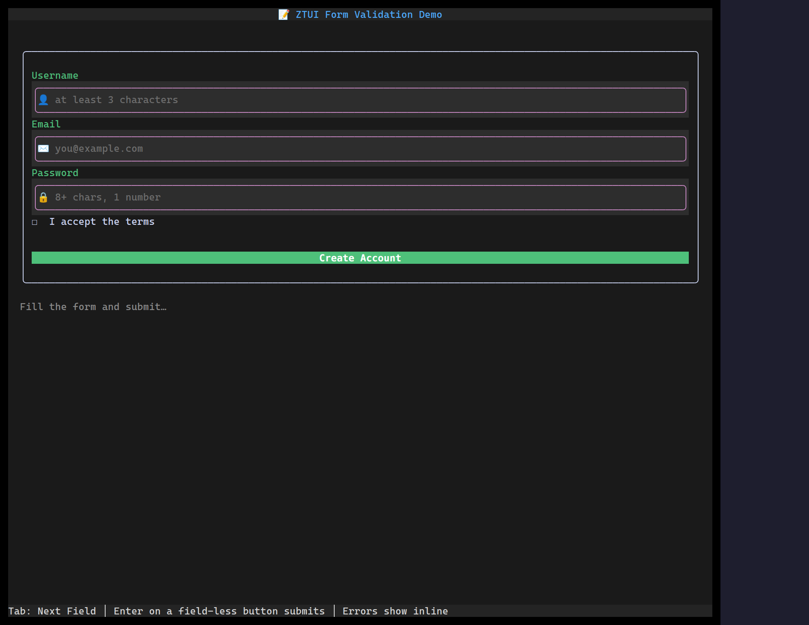

`<Form>` groups field controls (Input, Checkbox, Select, …), runs their
validators, aggregates their values by field name, and reports validity on
submit — so individual controls stay simple.

## Usage

```tsx
import { Button, Form, Input } from "@huyz0/ztui/react";

<Form
  onSubmit={(values) => console.log(values)}
  onValidate={(valid) => console.log("valid:", valid)}
>
  <Input name="email" label="Email" validators={[required(), email()]} />
  <Input name="name" label="Name" validators={[required()]} />
  <Button type="submit">Save</Button>
</Form>;
```

## Key props

- `onSubmit` — fired with `Record<name, value>` once all fields pass.
- `onValidate` — fired with `(valid, values)` as fields change.
- `messageMode` — how validation messages are surfaced (inline vs. summary).

Controls inside a form expose `validators` / `validateOn` / `onValidate`; the
form recolors invalid fields and blocks submit until they pass.

[Full demo →](https://github.com/huyz0/ztui/blob/main/examples/form_validation_demo.tsx)
