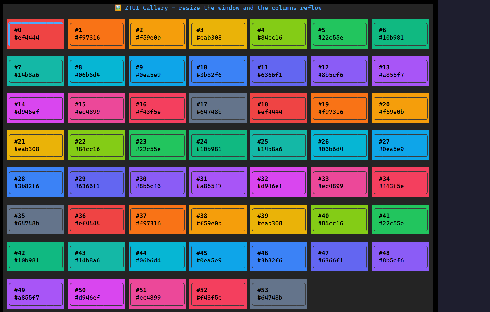

`<GalleryView>` lays arbitrary items out as a grid whose **column count flows
from the container width** — resize the terminal and it reflows. Arrows move a
2D cursor, the wheel and scrollbar scroll the overflow, and you render each cell
yourself with `renderItem`. It's the building block behind card pickers (themes,
files, images, emoji).

## Usage

```tsx
import { GalleryView } from "@huyz0/ztui/react";

const swatches = palette.map((color, id) => ({ id, color }));

<GalleryView
  items={swatches}
  itemWidth={16}
  itemHeight={4}
  onSelect={(index) => setCursor(index)}
  onActivate={(index) => choose(swatches[index])}
  renderItem={(item, { selected }) => (
    <VBox
      style={{
        width: "100%",
        height: "100%",
        border: selected ? "double" : "rounded",
        background: item.color,
      }}
    >
      <Label style={{ color: "#000" }}>{` #${item.id}`}</Label>
    </VBox>
  )}
/>;
```

## Key props

- `items` / `renderItem` — the data and a `(item, { index, selected }) => node`
  renderer. Highlighting the selected cell is up to `renderItem`.
- `itemWidth` / `itemHeight` — fixed cell size in cells; `itemWidth` is the basis
  for the auto column count.
- `columns` — fix the column count instead of deriving it from the width.
- `gap` — spacing between cells on both axes (default 1).
- `selectedIndex` / `defaultSelectedIndex` — controlled or uncontrolled cursor.
- `onSelect(index)` / `onActivate(index)` — cursor moved, and Enter/Space or
  double-click.

The host element needs a bounded height (via `style`) so the grid can scroll.

## Interaction

`←`/`→` move within a row · `↑`/`↓` move across rows · `PgUp`/`PgDn`/`Home`/`End`
jump · `Enter`/`Space` activates · the mouse **wheel** and **scrollbar** scroll ·
click a cell to select (double-click activates). The selected cell is always
scrolled into view, and the columns re-flow when the terminal resizes.
