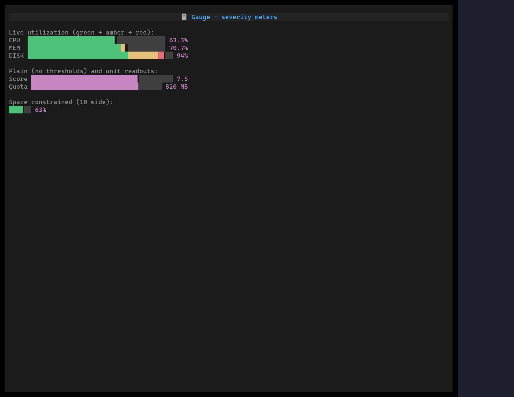

`<Gauge>` is a single-value meter — a labelled bar whose fill is coloured by
severity **thresholds** (green → amber → red) with a value readout. Use it for
utilization, quota, and score signals (CPU, disk, rate limits) where the *level*
carries meaning, unlike a plain [progress bar](/widgets/waiting/) which only
shows progress in one colour.

Each track cell colours by the band it falls in, so the filled portion reads as
coloured zones; cells past the value are a dim track.

## Usage

```tsx
import { Gauge } from "@huyz0/ztui/react";

<Gauge
  label="CPU"
  value={82}
  unit="%"
  thresholds={[
    { at: 0, color: "$success" },
    { at: 70, color: "$warning" },
    { at: 90, color: "$error" },
  ]}
  style={{ width: 48 }}
/>;
```

## Key props

- `value`, `min`, `max` — the value and its scale (defaults `0`–`100`).
- `label` — optional text shown before the bar.
- `unit` — readout unit (e.g. `%`, `MB`); when unset the readout is a percentage.
- `thresholds` — `{ at, color }[]` severity bands; the fill colours by the band each cell falls in.
- `color` — base fill colour when no threshold applies (default `$accent`).
- `showValue` — print the readout after the bar (default `true`).

Under a tight width the gauge sheds the readout, then the label, to keep at
least a one-cell bar.

[Full demo →](https://github.com/huyz0/ztui/blob/main/examples/gauge_demo.tsx)
