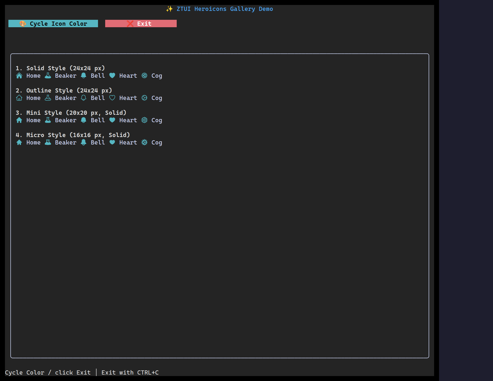

`<HeroIcon>` draws an icon from the [Heroicons](https://heroicons.com) set. On the
terminal it rasterizes the SVG to the best graphics protocol (Kitty / iTerm2 /
Sixel); on the web/canvas backend it renders the SVG **natively** (the browser
rasterizes it at the device pixel ratio). `currentColor` is tinted to the icon's
`color`, so icons follow your theme.

## Usage

```tsx
import { HBox, HeroIcon } from "ztui/react";

<HBox>
  <HeroIcon name="home" variant="solid" style={{ color: "$primary" }} />
  <HeroIcon name="bell" variant="outline" style={{ color: "yellow" }} />
  <HeroIcon name="heart" variant="mini" style={{ color: "red" }} />
</HBox>;
```

## Key props

- `name` — the Heroicon name (e.g. `"home"`, `"academic-cap"`, `"beaker"`).
- `variant` — `"solid"` | `"outline"` | `"mini"` | `"micro"` (default `"solid"`).
- `style.color` — tints the icon (via `currentColor`).

:::note
Icons need an SVG rasterizer for the terminal graphics protocols (optional
`sharp`); without it they fall back to a text glyph in the terminal. The
web/canvas backend always renders the vector natively.
:::

[Full demo →](https://github.com/huyz0/ztui/blob/main/examples/heroicons_demo.tsx)
