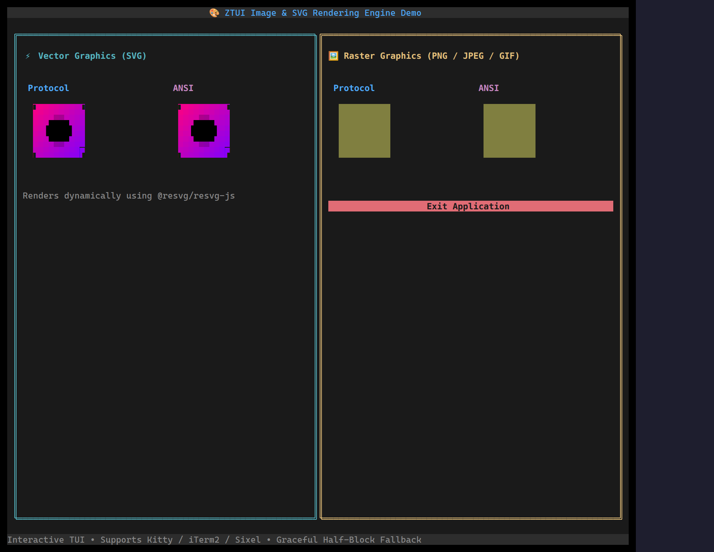

`<Image>` displays raster (PNG/JPEG/GIF) or SVG images inline. It uses the
terminal's best graphics protocol (Kitty / iTerm2 / Sixel) when available and
falls back to Unicode half-block "ANSI art" otherwise — and on the web backend it
paints straight to the canvas.

## Usage

```tsx
import { Image } from "ztui/react";

// From a file path…
<Image src="./logo.png" style={{ width: 20, height: 10 }} />

// …or force the Unicode block fallback regardless of capability:
<Image src="./logo.svg" ansi style={{ width: 20, height: 10 }} />
```

## Key props

- `src` — a file path or inline SVG markup.
- `buffer` — raw image bytes, as an alternative to `src`.
- `ansi` — force the Unicode half-block fallback instead of a graphics protocol.

:::note
SVG rasterization uses an optional `sharp`; without it, SVGs fall back to a
placeholder. Raster decoding works out of the box.
:::

[Full demo →](https://github.com/huyz0/ztui/blob/main/examples/image_demo.tsx)
