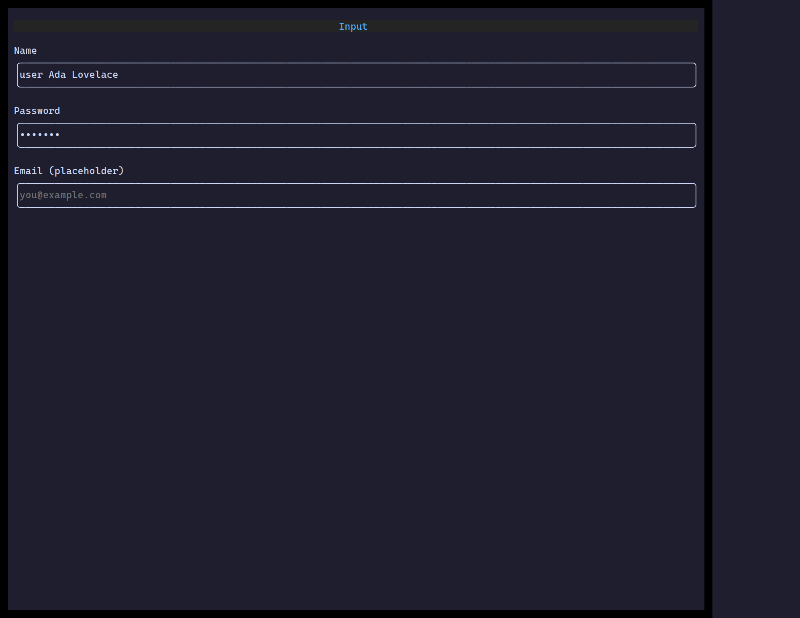

`<Input>` is a single-line editor: caret movement, selection, clipboard, an
optional leading/trailing icon, password masking, and form validation.

## Usage

```tsx
import { useState } from "react";
import { Input } from "@huyz0/ztui/react";

function NameField() {
  const [name, setName] = useState("");
  return <Input value={name} onChange={setName} icon="user" placeholder="Your name" />;
}
```

## Key props

- `value` / `onChange` — controlled text.
- `type` — `"text"` | `"password"` | `"email"`.
- `icon` / `suffixIcon` — leading/trailing glyphs.
- `placeholder` — shown when empty.
- `validators` / `validateOn` / `onValidate` · `invalid` — validation hooks.

[Full demo →](https://github.com/huyz0/ztui/blob/main/examples/input_demo.tsx)
