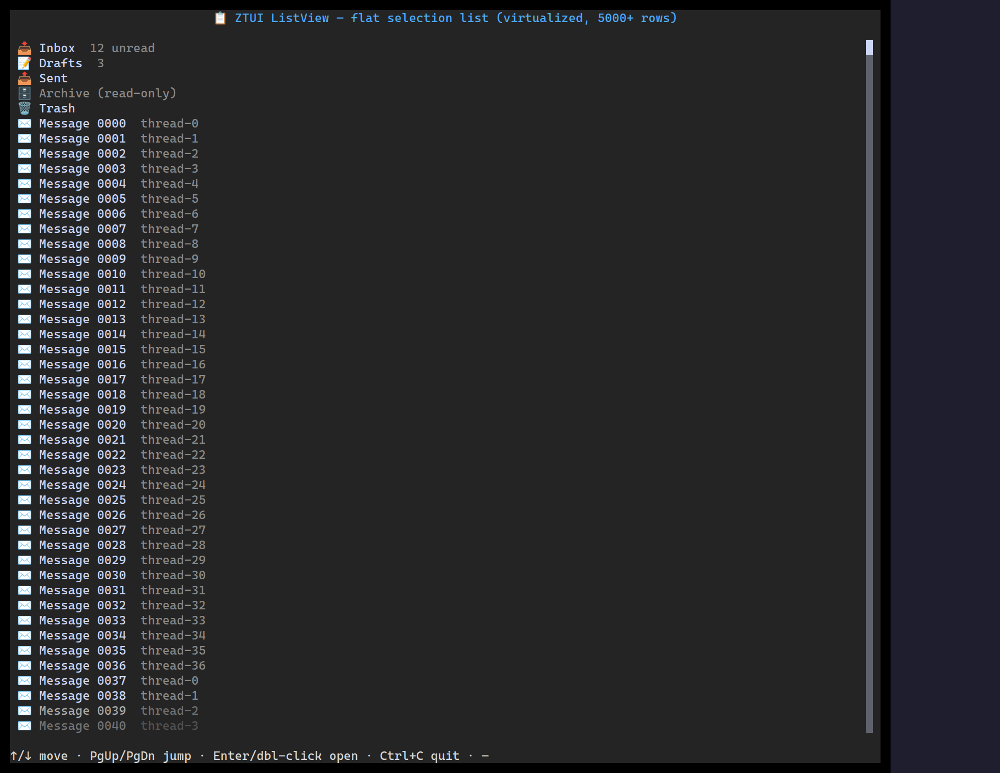

`<ListView>` is a virtualized single-column list — selection, scrolling, and
Enter-to-activate, with each item optionally carrying an icon and a muted detail.

## Usage

```tsx
import { ListView } from "ztui/react";

const items = [
  { id: "inbox", label: "Inbox", icon: "inbox" },
  { id: "sent", label: "Sent", icon: "paper-airplane" },
  { id: "drafts", label: "Drafts", detail: "3" },
];

<ListView
  items={items}
  selectedId="inbox"
  onSelect={(item) => console.log("selected", item.id)}
  onActivate={(item) => console.log("opened", item.id)}
/>;
```

## Key props

- `items` — `ListItem[]` (`{ id, label, icon?, detail? }`).
- `selectedId` / `onSelect` — controlled selection.
- `onActivate` — fired on `Enter`/`Space`.
- `selectedBackground` / `mutedColor` — styling hooks.

## Interaction

`↑`/`↓` move · `PgUp`/`PgDn`/`Home`/`End` paginate · `Enter`/`Space` activates ·
click a row to select.

[Full demo →](https://github.com/huyz0/ztui/blob/main/examples/listview_demo.tsx)
