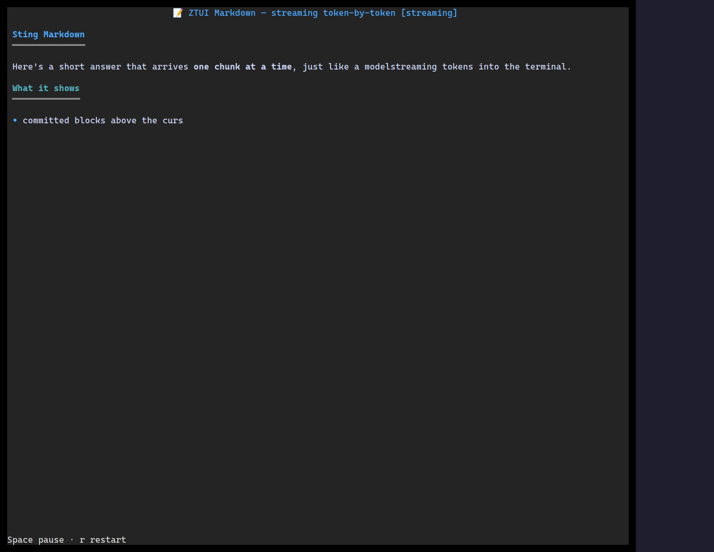

`<Markdown>` renders Markdown to styled widgets. Fenced code blocks are
syntax-highlighted (with `@huyz0/ztui/syntax`), ` ```mermaid ` blocks render as diagrams
(with `@huyz0/ztui/mermaid`), and incremental updates are handled efficiently — so it
works well for streaming LLM output token-by-token.

## Usage

```tsx
import { Markdown, render } from "@huyz0/ztui/react";
import "@huyz0/ztui/markdown"; // registers the widget + pulls `marked`
import "@huyz0/ztui/syntax"; // optional: highlight fenced code

const md = `# Report

- **Status:** green
- Latency p95: \`142ms\`

\`\`\`ts
export const ok = true;
\`\`\`
`;

<Markdown>{md}</Markdown>;
```

## Notes

- The widget's content is its child text — pass the Markdown source as children.
- Requires the `@huyz0/ztui/markdown` entry (and `marked`); highlighting and diagrams are
  opt-in via `@huyz0/ztui/syntax` / `@huyz0/ztui/mermaid`.
- Streaming: append to the source and the widget re-lexes only the changed tail.

[Full demo →](https://github.com/huyz0/ztui/blob/main/examples/markdown_stream_demo.tsx)
