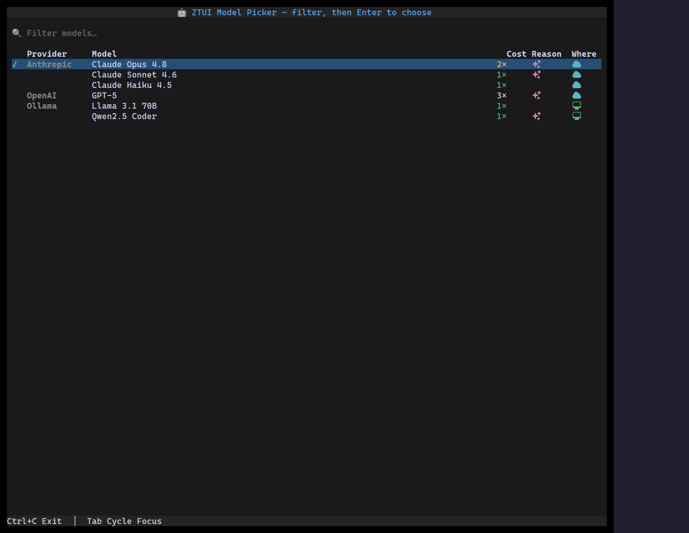

`<ModelPicker>` is a filterable table list for choosing an LLM. Each row shows
the **provider**, the model **name**, a **cost** multiplier badge (coloured by
magnitude), a **reasoning** icon, and a **local/remote** icon (icons, not text).
Type in the filter to narrow the rows; arrow-navigate and press Enter (or
double-click) to choose. It's built on [`Table`](/ztui/widgets/table/),
[`Input`](/ztui/widgets/input/), and [`HeroIcon`](/ztui/widgets/heroicon/).

## Usage

```tsx
import { useState } from "react";
import { ModelPicker } from "@huyz0/ztui/react";
import type { ModelEntry } from "@huyz0/ztui/react";

const MODELS: ModelEntry[] = [
  { id: "opus", provider: "Anthropic", name: "Claude Opus 4.8", cost: 2, reasoning: true, location: "remote" },
  { id: "haiku", provider: "Anthropic", name: "Claude Haiku 4.5", cost: 1, location: "remote" },
  { id: "gpt5", provider: "OpenAI", name: "GPT-5", cost: "3×", reasoning: true, location: "remote" },
  { id: "llama", provider: "Ollama", name: "Llama 3.1 70B", cost: 1, location: "local" },
];

function Picker() {
  const [id, setId] = useState("opus");
  return <ModelPicker models={MODELS} value={id} onSelect={(m) => setId(m.id)} />;
}
```

## A model entry

```ts
interface ModelEntry {
  id: string;                       // stable id; the committed selection matches on this
  name: string;                     // "Claude Opus 4.8"
  provider?: string;                // "Anthropic"
  cost?: number | string;           // 1 → "1×", 2 → "2×" (coloured), or a custom string ("3×", "$3/Mtok")
  reasoning?: boolean;              // shows a reasoning icon
  location?: "local" | "remote";    // shows a local/remote icon instead of text
}
```

A **numeric** `cost` renders as a multiplier badge tinted by magnitude (`≤1`
green, `2` amber, more red); a **string** renders verbatim for custom pricing.
Columns appear **only when at least one model supplies that field**, so a list
of bare `{ id, name }` entries renders as a plain name list.

## Key props

- `models` — the entries to choose from.
- `value` — the selected model id (marked with a ✓).
- `onSelect(model)` — fired when a row is chosen (Enter / double-click).
- `filterable` — show the text filter box (default `true`); `filterPlaceholder`
  sets its hint and `filterFields` picks which fields it matches (default name +
  provider).
- `groupByProvider` — group rows by provider with the provider name shown once
  (bold) at the head of each run (default `true`).
- `icons` — override the icon-column glyphs: `{ local, remote, reasoning }`
  (Heroicon names; defaults `computer-desktop` / `cloud` / `sparkles`).
- `extraColumns` — append your own [`TableColumn`](/ztui/widgets/table/)s after
  the built-ins, so the picker stays composable.

## Pairing with the composer

Drop a `ModelPicker` in a popover or panel and open it from a
[`Conversation`](/ztui/widgets/conversation/) — e.g. a `/model` command in the
`composer`, or a model badge in the conversation's `hintTrailing` slot that opens
the picker on click.

[Full demo →](https://github.com/huyz0/ztui/blob/main/examples/model_picker_demo.tsx)
