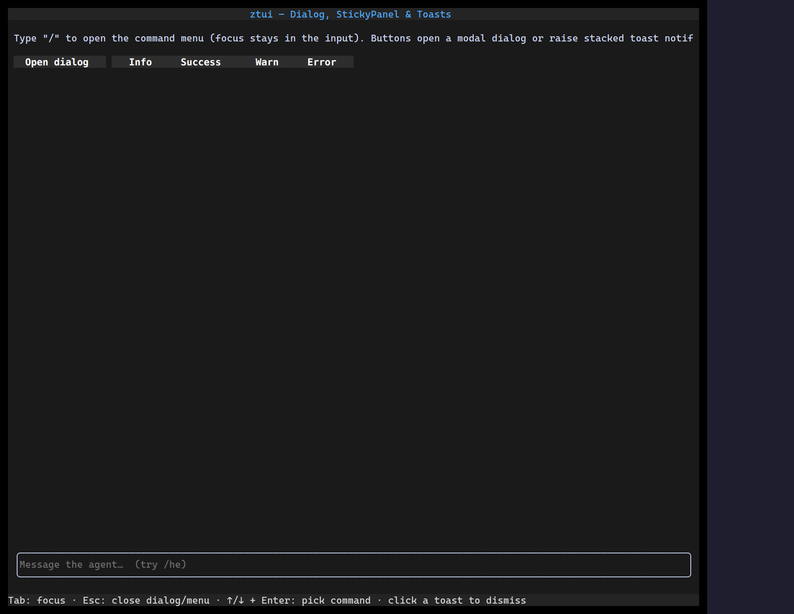

Overlays render on a layer above the main tree. `<Dialog>` is a focus-trapping
modal; `<StickyPanel>` is a non-modal popup (think slash-command menus, tooltips)
anchored near other content.

## Usage

```tsx
import { useState } from "react";
import { Button, Dialog, Label } from "ztui/react";

function Confirm() {
  const [open, setOpen] = useState(false);
  return (
    <>
      <Button onClick={() => setOpen(true)}>Delete…</Button>
      <Dialog open={open} onClose={() => setOpen(false)} closeOnEscape dim>
        <Label>Are you sure?</Label>
      </Dialog>
    </>
  );
}
```

## Key props (Dialog)

- `open` / `onClose` — visibility and close callback.
- `closeOnEscape` / `closeOnOutsideClick` — dismissal behavior.
- `dim` / `dimFade` — dim (and optionally fade) the backdrop.
- `panelStyle` — style the dialog panel.

[Full demo →](https://github.com/huyz0/ztui/blob/main/examples/overlay_demo.tsx)
