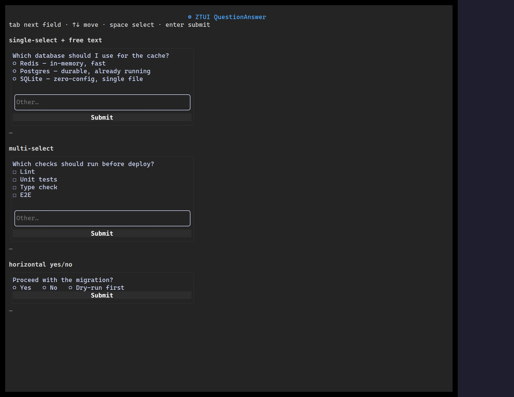

`<QuestionAnswer>` renders a question with selectable options — single or multi
select, with an optional "other" free-text entry — ideal for wizards, surveys,
and agent prompts.

## Usage

```tsx
import { QuestionAnswer } from "@huyz0/ztui/react";

<QuestionAnswer
  question="Pick your stack"
  mode="single"
  options={[
    { label: "TypeScript", value: "ts" },
    { label: "Rust", value: "rs" },
    { label: "Go", value: "go" },
  ]}
  onSubmit={(result) => console.log(result.selected, result.other)}
/>;
```

## Key props

- `question` — the prompt text.
- `options` — `{ label, value, hint? }[]`.
- `mode` — `"single"` or `"multi"`.
- `other` — enable a free-text "other" answer.
- `onSubmit` — fired with `{ selected: string[], other? }`.

[Full demo →](https://github.com/huyz0/ztui/blob/main/examples/questionanswer_demo.tsx)
