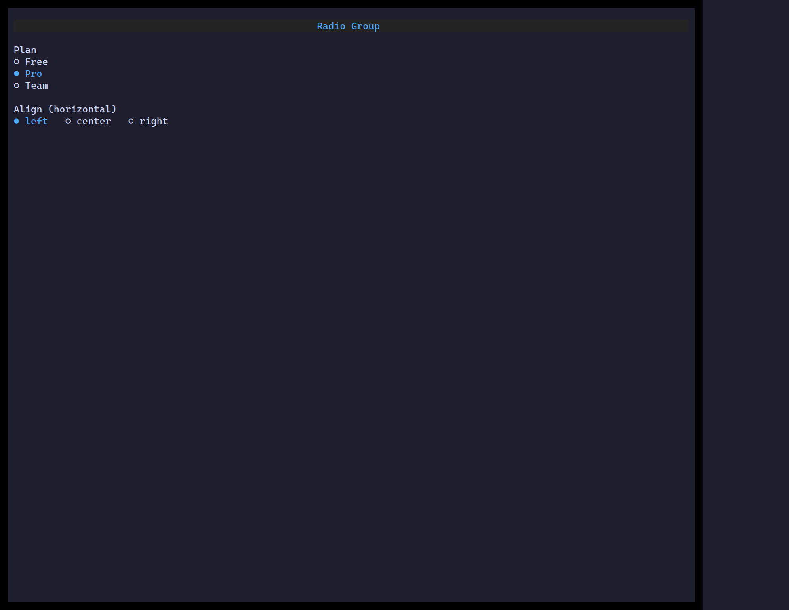

`<RadioGroup>` picks exactly one option from a set, laid out vertically or
horizontally. Options are plain strings or `{ value, label }` objects.

## Usage

```tsx
import { useState } from "react";
import { RadioGroup } from "@huyz0/ztui/react";

function Plan() {
  const [plan, setPlan] = useState("pro");
  return (
    <RadioGroup
      options={[
        { value: "free", label: "Free" },
        { value: "pro", label: "Pro" },
        { value: "team", label: "Team" },
      ]}
      value={plan}
      onChange={setPlan}
    />
  );
}
```

## Key props

- `options` — `(string | { value, label })[]`.
- `value` / `onChange` — the selected value.
- `orientation` — `"vertical"` (default) or `"horizontal"`.

[Full demo →](https://github.com/huyz0/ztui/blob/main/examples/radio_demo.tsx)
