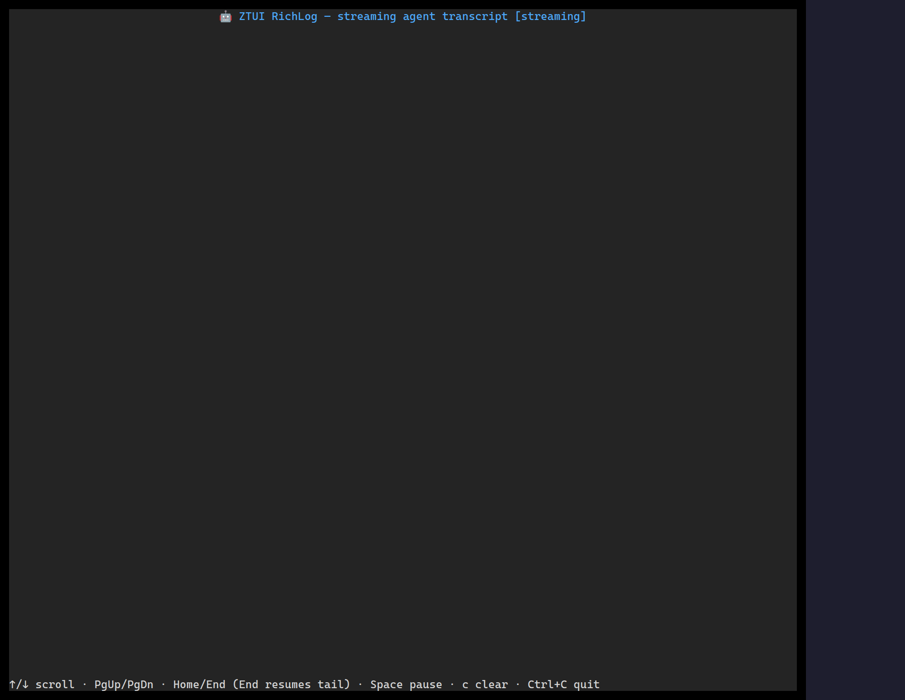

`<RichLog>` is an append-only viewport for streaming output — logs, REPL
transcripts, build output. It tails new lines automatically until you scroll up,
caps retained history, and renders inline markup.

## Usage

```tsx
import { RichLog } from "ztui/react";

<RichLog
  lines={[
    "[green]✓[/] build succeeded",
    "[yellow]![/] 2 warnings",
    "[dim]12:04:01[/] watching for changes…",
  ]}
  maxLines={1000}
  autoScroll
  wrap
/>;
```

## Key props

- `lines` — the log lines (inline `[color]…[/]` markup supported).
- `maxLines` — retained-history cap (older lines drop off).
- `autoScroll` — tail new output until the user scrolls up.
- `wrap` — soft-wrap long lines instead of horizontal scroll.

[Full demo →](https://github.com/huyz0/ztui/blob/main/examples/richlog_demo.tsx)
