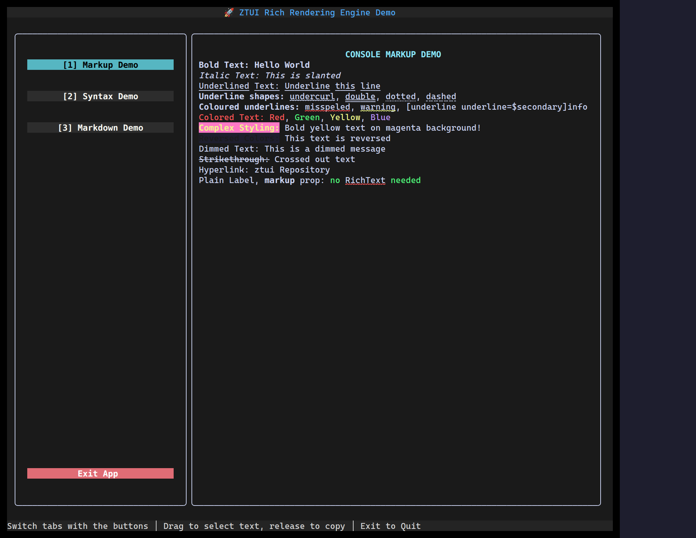

`<RichText>` renders text with inline markup so you can mix styles within one
run without nesting widgets: `[bold]…[/]`, `[color]…[/]`, links, and more.

## Usage

```tsx
import { RichText } from "@huyz0/ztui/react";

<RichText>[bold]Status:[/] [green]ok[/] · latency [cyan]142ms[/]</RichText>
<RichText style={{ align: "center", color: "$primary", bold: true }}>
  Centered heading
</RichText>;
```

## Notes

- The content is the child string; markup tags are parsed inline.
- The element's `style` applies as the base; inline tags layer on top.
- For whole documents (headings, lists, code), use [Markdown](/ztui/widgets/markdown/) instead.

[Full demo →](https://github.com/huyz0/ztui/blob/main/examples/rich_demo.tsx)
