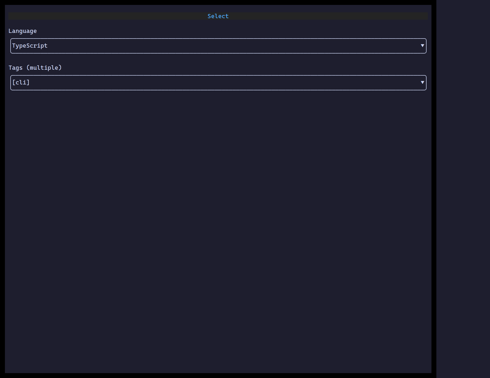

`<Select>` is a dropdown of options — single choice, or `multiple` for a set.
Options are plain strings or `{ value, label }` objects.

## Usage

```tsx
import { useState } from "react";
import { Select } from "@huyz0/ztui/react";

function LangPicker() {
  const [lang, setLang] = useState("TypeScript");
  return <Select options={["TypeScript", "Rust", "Go"]} value={lang} onChange={setLang} />;
}
```

## Key props

- `options` — `(string | { value, label })[]`.
- `value` — the selected value (or `string[]` when `multiple`).
- `multiple` — multi-select; `onChange` receives an array.
- `placeholder` — shown when nothing is selected.

[Full demo →](https://github.com/huyz0/ztui/blob/main/examples/select_demo.tsx)
