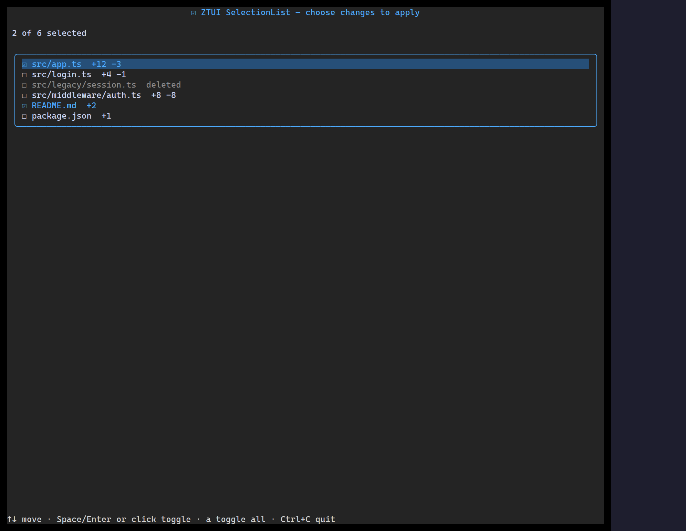

`<SelectionList>` is a multi-select checklist: a moving cursor plus per-row
checked state, controlled or uncontrolled.

## Usage

```tsx
import { SelectionList } from "@huyz0/ztui/react";

const items = [
  { id: "ts", label: "TypeScript" },
  { id: "rs", label: "Rust" },
  { id: "go", label: "Go" },
];

<SelectionList
  items={items}
  defaultValue={["ts"]}
  onChange={(ids) => console.log("checked", ids)}
/>;
```

## Key props

- `items` — `ListItem[]`.
- `value` / `defaultValue` — selected ids (controlled or initial).
- `onChange` — fired with the new array of checked ids.
- `glyphSet` — customize the checked/unchecked/cursor glyphs.

## Interaction

`↑`/`↓` move the cursor · `Space`/`Enter` toggles the row · `a` toggles all.

[Full demo →](https://github.com/huyz0/ztui/blob/main/examples/selection_list_demo.tsx)
