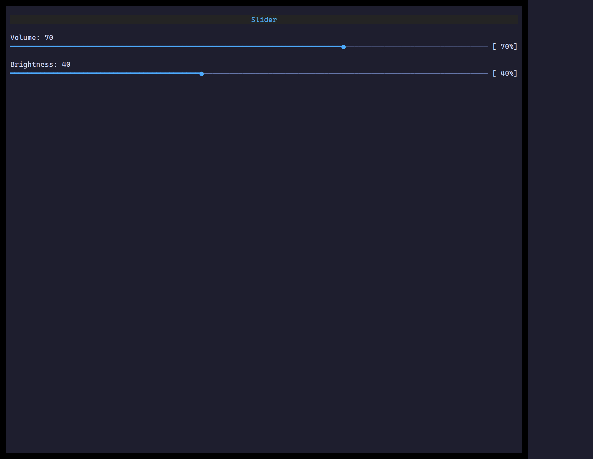

`<Slider>` picks a number in `[min, max]` — drag the thumb, click the track, or
use the arrow keys when focused.

## Usage

```tsx
import { useState } from "react";
import { Slider } from "@huyz0/ztui/react";

function Volume() {
  const [v, setV] = useState(70);
  return <Slider value={v} min={0} max={100} step={5} onChange={setV} />;
}
```

## Key props

- `value` / `onChange` — controlled number.
- `min` / `max` — range bounds (default 0–100).
- `step` — increment for keys/drag (default 1).

[Full demo →](https://github.com/huyz0/ztui/blob/main/examples/slider_demo.tsx)
