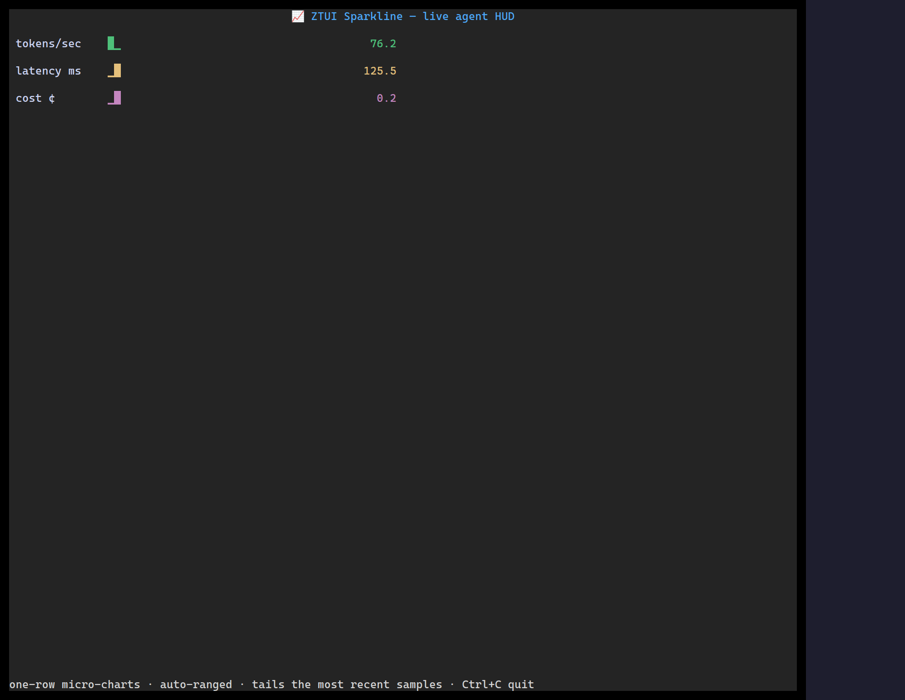

`<Sparkline>` turns a numeric series into a one-line (or multi-row) trend chart
using partial-block glyphs — ideal for dashboards and status bars.

## Usage

```tsx
import { Sparkline } from "@huyz0/ztui/react";

<Sparkline
  data={[3, 7, 4, 9, 12, 8, 15, 11, 6]}
  showValue
  style={{ width: 40, color: "$success" }}
/>;
```

## Key props

- `data` — `number[]`, the series to plot.
- `min` / `max` — fix the value range (defaults to the data's own range).
- `showValue` — append the latest value as text.

[Full demo →](https://github.com/huyz0/ztui/blob/main/examples/sparkline_demo.tsx)
