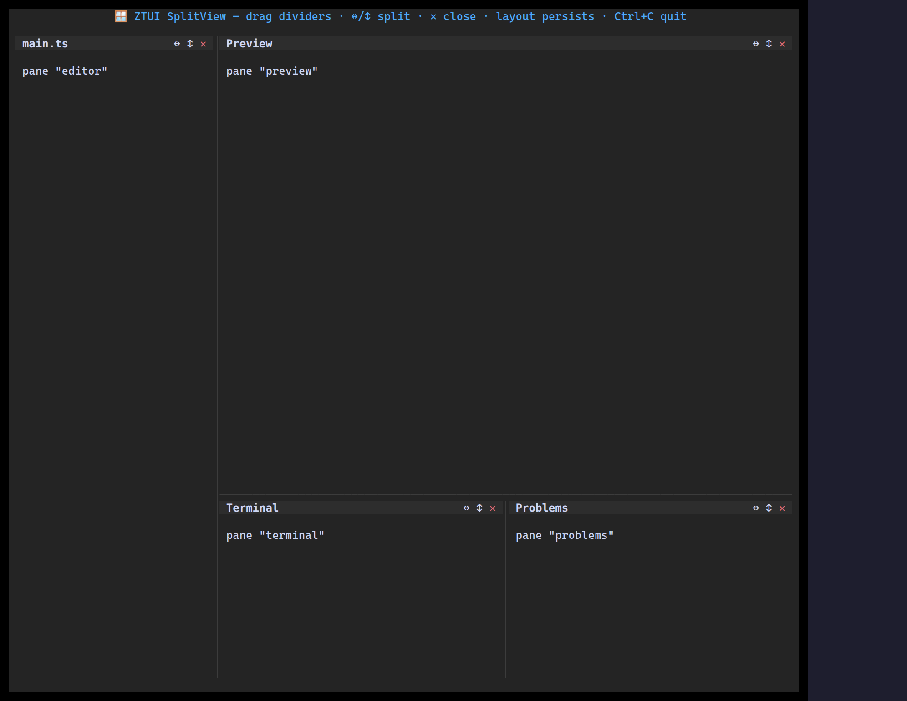

`<SplitView>` renders a tree of panes you can split horizontally or vertically
and resize with draggable splitters. The layout is a plain, **serializable**
`SplitNode` tree, so you can persist and restore it.

## Usage

```tsx
import { useState } from "react";
import { Label, SplitView, type SplitNode } from "ztui/react";

function Panes() {
  const [root, setRoot] = useState<SplitNode>({
    type: "split",
    direction: "horizontal",
    children: [
      { type: "leaf", id: "a", title: "Left", content: <Label>Left pane</Label> },
      { type: "leaf", id: "b", title: "Right", content: <Label>Right pane</Label> },
    ],
  });
  return <SplitView root={root} onChange={setRoot} />;
}
```

## Key props

- `root` — the `SplitNode` tree (`leaf` = `{ id, title?, content }`; `split` =
  `{ direction, children, sizes? }`).
- `onChange` — fired with the new tree after a resize/split/close.
- `controls` / `newPane` — customize per-pane actions and how new panes are created.

Helpers like `splitLeaf`, `closeLeaf`, `serializeSplit`, and `hydrateSplit` make
mutating and persisting the tree easy.

[Full demo →](https://github.com/huyz0/ztui/blob/main/examples/splitview_demo.tsx)
