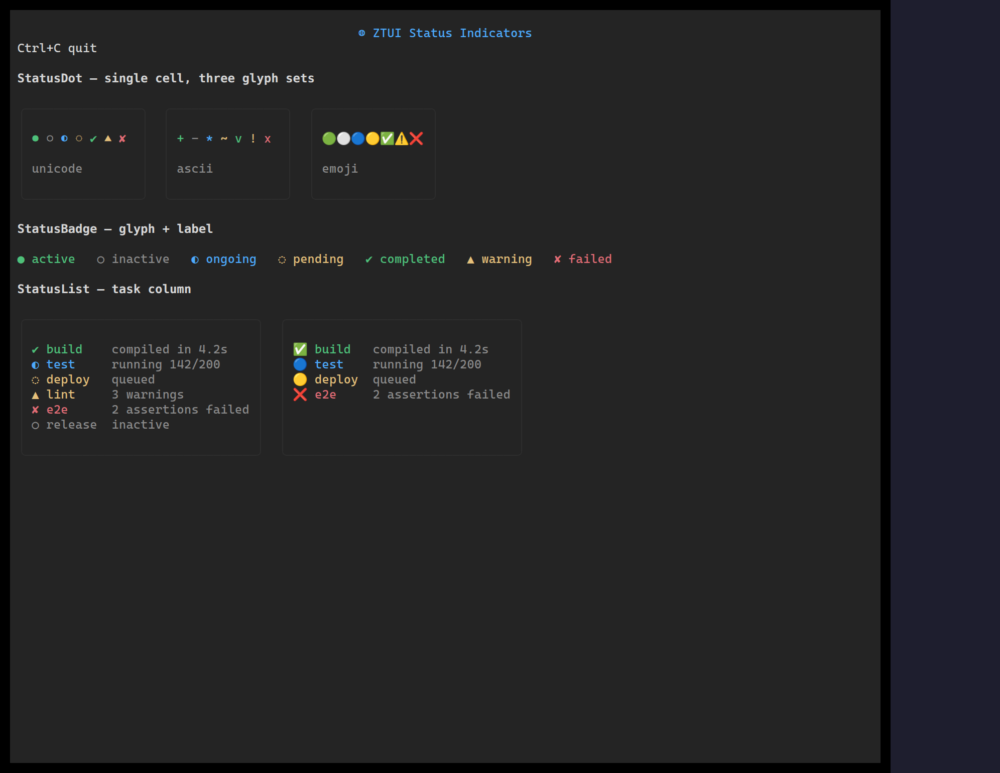

The status family renders a small set of states (`ok`, `warn`, `error`, `info`,
`pending`, …) as a colored dot, a labelled badge, or a list of items.

## Usage

```tsx
import { StatusBadge, StatusDot, StatusList } from "ztui/react";

<StatusDot state="ok" />
<StatusBadge state="warn" label="Degraded" />
<StatusList
  items={[
    { state: "ok", label: "API", detail: "142ms" },
    { state: "error", label: "Worker", detail: "timeout" },
  ]}
/>;
```

## Key props

- `state` — the status key driving the glyph and color.
- `label` (badge) / `items` (list) — text content.
- `glyphSet` — swap the per-state glyphs.

[Full demo →](https://github.com/huyz0/ztui/blob/main/examples/status_demo.tsx)
