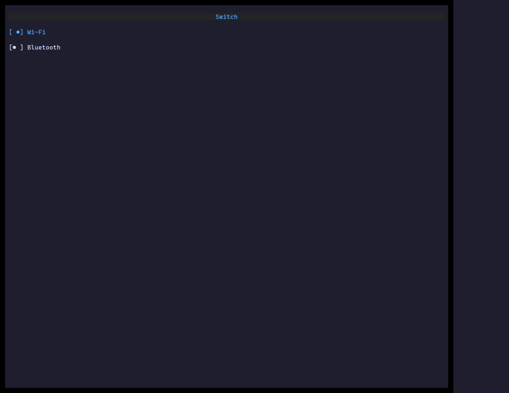

`<Switch>` is a boolean toggle styled as a sliding switch — the same data as a
[Checkbox](/ztui/widgets/checkbox/), a more "settings" look.

## Usage

```tsx
import { useState } from "react";
import { Switch } from "ztui/react";

function WifiToggle() {
  const [on, setOn] = useState(true);
  return <Switch active={on} onChange={setOn} label="Wi-Fi" />;
}
```

## Key props

- `active` / `onChange` — controlled boolean.
- `label` — text beside the switch.
- `validators` / `validateOn` / `onValidate` — validation hooks.

[Full demo →](https://github.com/huyz0/ztui/blob/main/examples/switch_demo.tsx)
