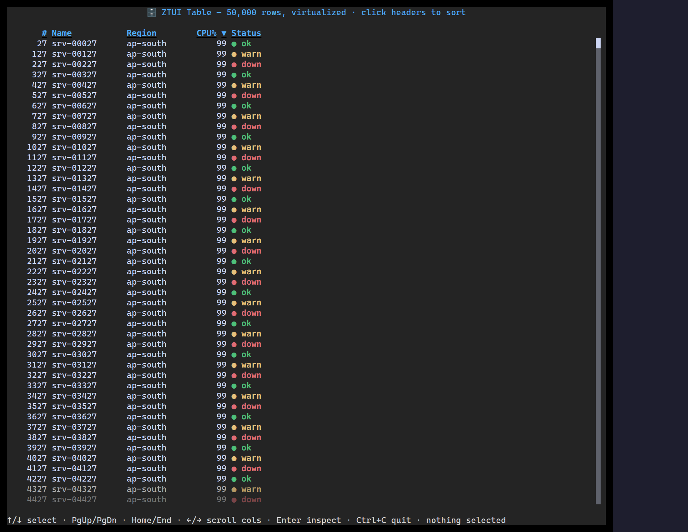

`<Table>` self-renders only the rows in the viewport, so per-frame work is bounded
regardless of dataset size. Columns size with fixed widths, `<n>fr`, or `auto`;
the header is pinned and sortable; cells can be plain text or nested widgets.

## Usage

```tsx
import { Table } from "ztui/react";

const rows = [
  { id: 1, name: "srv-00027", region: "ap-south", cpu: 99, status: "ok" },
  { id: 2, name: "srv-00127", region: "ap-south", cpu: 99, status: "warn" },
];

<Table
  data={rows}
  columns={[
    { key: "name", title: "Name", width: "1fr" },
    { key: "region", title: "Region" },
    { key: "cpu", title: "CPU %", width: 8 },
    { key: "status", title: "Status", render: (r) => r.status },
  ]}
  onActivate={(row) => console.log("entered", row)}
/>;
```

## Key props

- `data` — the row array (left untouched; sorting reorders an index over it).
- `columns` — `{ key, title, width?, render? }[]`. `width` is a number, `"<n>fr"`, or `"auto"`.
- `sort` / `onSortChange` — controlled sort state, or let the header manage it.
- `selectedIndex` / `onSelect` / `onActivate` — selection and Enter-to-activate.

## Interaction

`↑`/`↓` move selection · `PgUp`/`PgDn`/`Home`/`End` paginate · click a header to
sort · `Enter` activates the selected row.

[Full demo →](https://github.com/huyz0/ztui/blob/main/examples/table_demo.tsx)
