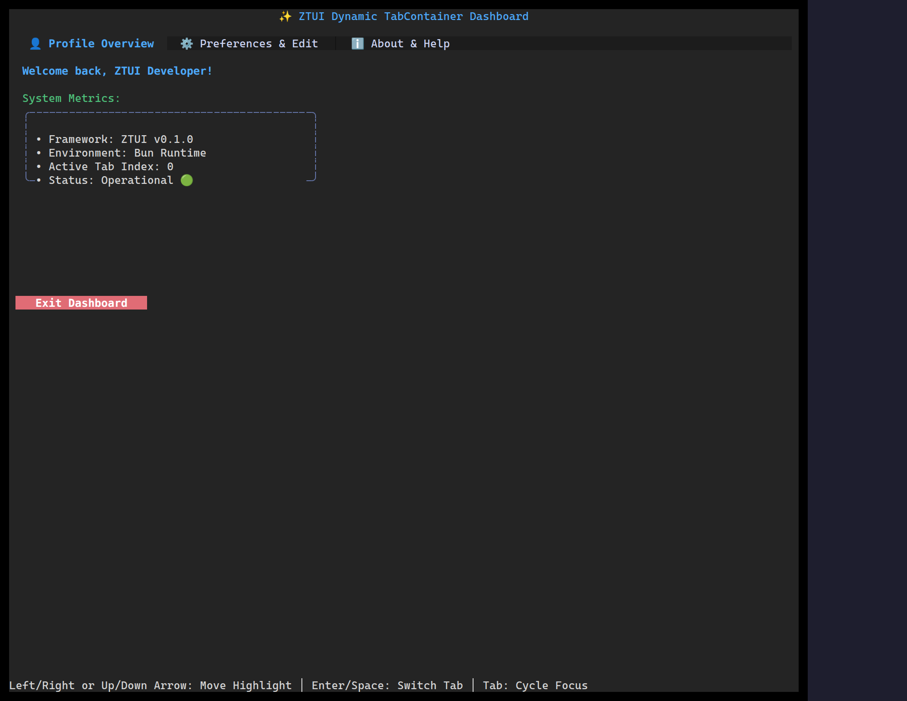

`<TabContainer>` shows a row of tabs and renders one child at a time. Each direct
child supplies its tab title via its `label` prop.

## Usage

```tsx
import { Label, TabContainer, VBox } from "ztui/react";

<TabContainer activeIndex={0} onChange={(i) => console.log("tab", i)}>
  <VBox label="Profile" style={{ padding: 1 }}>
    <Label>Profile panel</Label>
  </VBox>
  <VBox label="Preferences" style={{ padding: 1 }}>
    <Label>Preferences panel</Label>
  </VBox>
</TabContainer>;
```

## Key props

- Children — each child's `label` becomes its tab title.
- `activeIndex` / `onChange` — controlled active tab (or let it manage internally).

## Interaction

Click a tab, or use the arrow keys when the tab bar is focused.

[Full demo →](https://github.com/huyz0/ztui/blob/main/examples/tabcontainer_demo.tsx)
