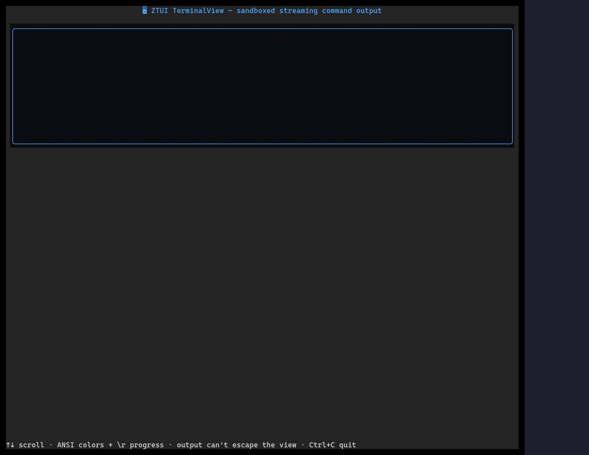

`<TerminalView>` parses an ANSI byte stream — colors, bold/dim/underline, `\r`
progress redraws — into its own internal cell grid and draws it as styled
content. It's **sandboxed**: the ANSI never touches the real terminal, so it's
safe to pipe arbitrary subprocess output into the UI.

## Usage

```tsx
import { TerminalView } from "ztui/react";

<TerminalView
  content={"\x1b[32m✓ build ok\x1b[0m\n\x1b[33m! 2 warnings\x1b[0m\n"}
  autoScroll
  maxLines={5000}
  style={{ height: 16 }}
/>;
```

## Key props

- `content` — the raw ANSI string (append to it to stream output).
- `wrap` — soft-wrap long lines.
- `autoScroll` — tail new output until the user scrolls up.
- `maxLines` — retained-history cap.

[Full demo →](https://github.com/huyz0/ztui/blob/main/examples/terminal_view_demo.tsx)
