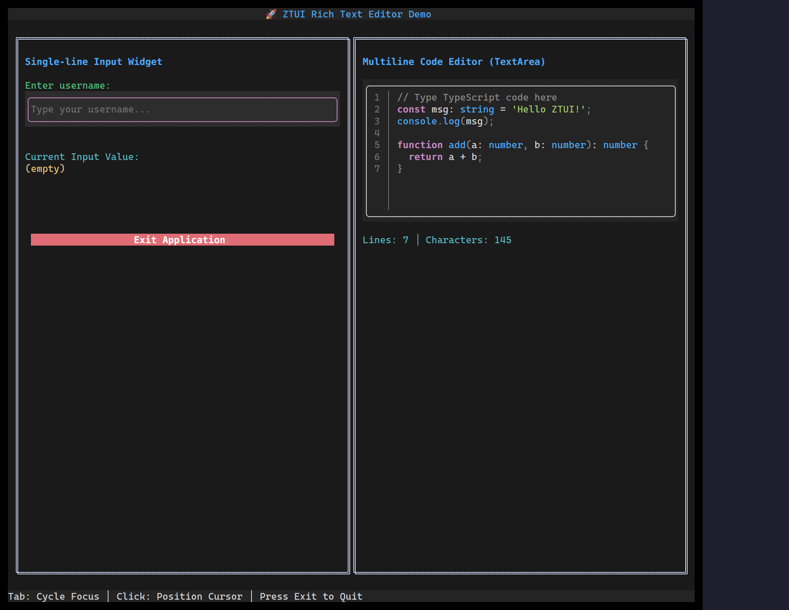

`<TextArea>` is a multi-line editor: caret movement, selection, clipboard, an
optional line-number gutter, optional syntax language, and form validation.

## Usage

```tsx
import { useState } from "react";
import { TextArea } from "ztui/react";

function Editor() {
  const [value, setValue] = useState("line one\nline two");
  return (
    <TextArea
      value={value}
      onChange={setValue}
      placeholder="Type here…"
      lineNumbers
      language="typescript"
      style={{ height: 12 }}
    />
  );
}
```

## Key props

- `value` / `onChange` — controlled text.
- `placeholder` — shown when empty.
- `lineNumbers` — toggle the gutter.
- `language` — syntax highlight (needs `ztui/syntax`).
- `validators` / `validateOn` / `onValidate` — form validation hooks.

[Full demo →](https://github.com/huyz0/ztui/blob/main/examples/textarea_demo.tsx)
