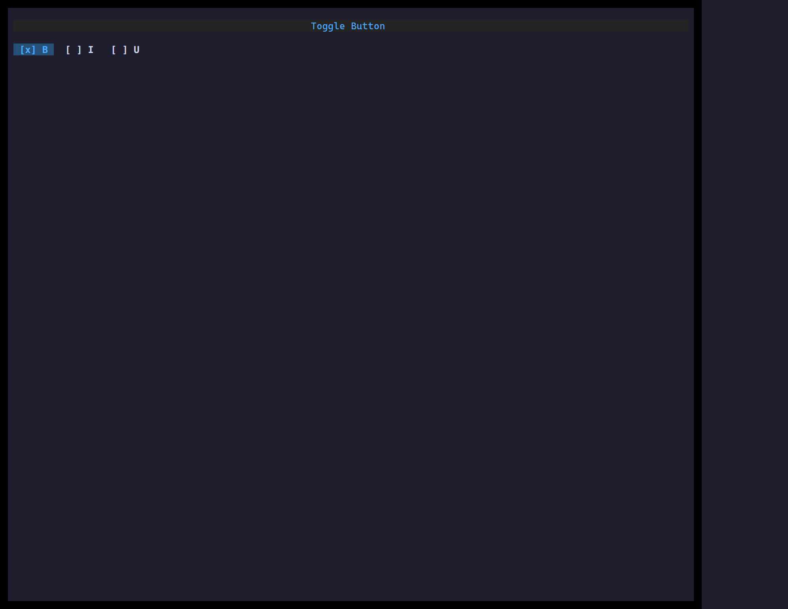

`<ToggleButton>` is a button with a sticky on/off state — ideal for toolbar
toggles (bold, italic, …) where the control reflects whether it's engaged.

## Usage

```tsx
import { useState } from "react";
import { ToggleButton } from "ztui/react";

function BoldToggle() {
  const [bold, setBold] = useState(false);
  return <ToggleButton active={bold} onChange={setBold} label="B" />;
}
```

## Key props

- `active` / `onChange` — controlled pressed state.
- `label` — button text.
- `onClick` — also fired on activation, if you need the raw event.

[Full demo →](https://github.com/huyz0/ztui/blob/main/examples/toggle_button_demo.tsx)
