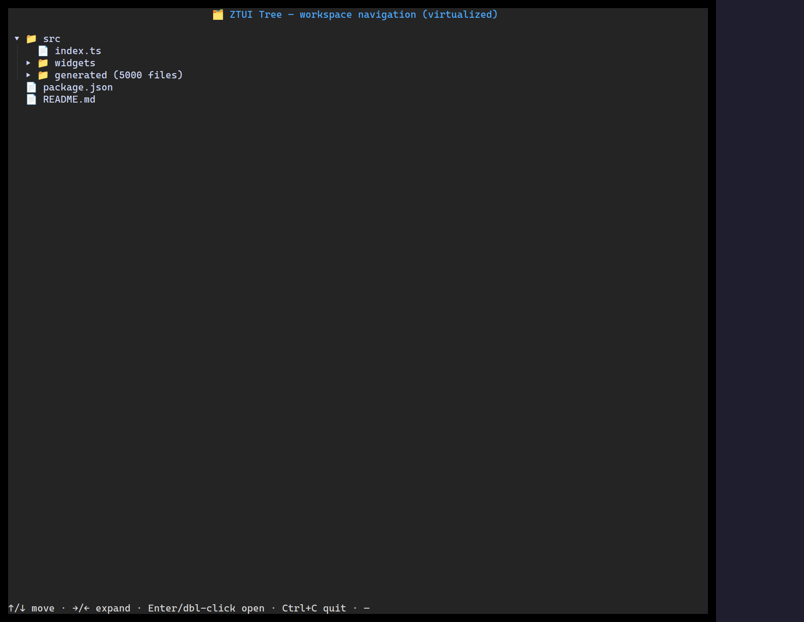

`<Tree>` flattens only the *expanded* nodes into a row list (collapsed subtrees
cost nothing) and renders only the visible window, so it scales to large, deep
trees. Input is a forest (`TreeNode[]`), so a flat top level needs no synthetic root.

## Usage

```tsx
import { Tree } from "ztui/react";

const data = [
  {
    id: "src",
    label: "src",
    children: [
      { id: "src/app.ts", label: "app.ts" },
      { id: "src/ui", label: "ui", children: [{ id: "src/ui/box.ts", label: "box.ts" }] },
    ],
  },
];

<Tree data={data} showGuides onSelect={(node) => console.log(node.id)} />;
```

## Key props

- `data` — `TreeNode[]` (`{ id, label, icon?, children? }`), a forest.
- `hideRoot` — promote a single root's children to the top level.
- `expanded` / `onExpandedChange` — controlled expansion, or let it manage internally.
- `selectedId` · `onSelect` · `onActivate` · `onToggle`.
- `showGuides` / `guideColor` — indentation guide lines.

## Interaction

`↑`/`↓` move selection · `→`/`←` expand/collapse (or step in/out) · `Enter`/`Space`
toggles · click the arrow to toggle, the row to select.

[Full demo →](https://github.com/huyz0/ztui/blob/main/examples/tree_demo.tsx)
