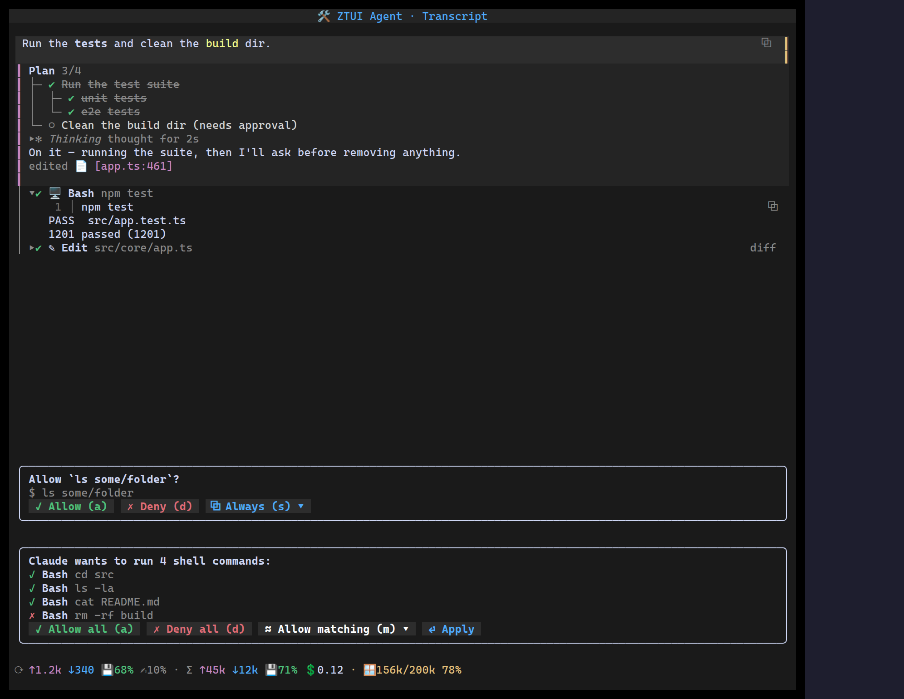

`<UsageMeter>` surfaces an agent turn's economics: per-turn and per-session
input (`↑`) / output (`↓`) tokens, prompt-cache hit (`💾`) and creation (`✍`)
ratios, session cost (`💲`), and a colour-coded context-window fill bar
(`🪟 used/size ████░░ %`, green → amber → red as it fills).

Every section is **optional** — omit a field and it's hidden, so cost only shows
when you can compute it.

## Usage

```tsx
import { UsageMeter } from "@huyz0/ztui/react";

<UsageMeter
  variant="compact"
  turn={{ input: 1234, output: 340, cacheRead: 840, cacheWrite: 120 }}
  session={{ input: 45_000, output: 12_000, cacheRead: 32_000 }}
  contextSize={200_000}
  contextUsed={156_000}
  cost={0.12}
/>;
```

## Key props

- `turn` / `session` — `TokenUsage` `{ input, output, cacheRead?, cacheWrite? }`
  for the last turn and the running session.
- `contextSize` / `contextUsed` — drive the context-window bar (shows numbers and
  percent, e.g. `🪟 156k/200k 78%`).
- `cost` — session cost; hidden when omitted.
- `variant` — `"full"` (three tight rows) or `"compact"` (one dense line).

## Compact mode

The compact line is **click-to-expand**: clicking it (or pressing an optional
`expandKey`) opens the full meter in a popover, like a context menu — Escape or an
outside click closes it. Set `expandable={false}` to disable. This keeps the
status line to one row while the full breakdown is a click away.

[Full demo →](https://github.com/huyz0/ztui/blob/main/examples/tool_call_demo.tsx)
