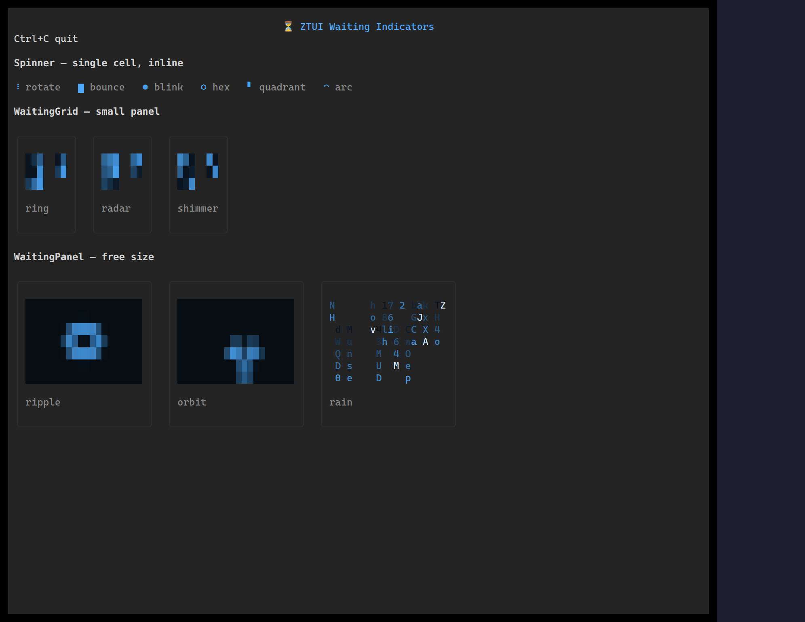

For work in flight, ztui offers a `Spinner` (indeterminate), a `ProgressBar`
(determinate or indeterminate, with optional eased animation), and a
`WaitingPanel` (a larger breathing placeholder).

## Usage

```tsx
import { ProgressBar, Spinner, WaitingPanel } from "ztui/react";

<Spinner mode="dots" />
<ProgressBar value={0.62} showPercent animate />
<ProgressBar indeterminate />
<WaitingPanel variant="pulse" />
```

## Key props

- **Spinner** — `mode` (preset frame set), `interval`, custom `frames`.
- **ProgressBar** — `value` in `[min, max]`, `showPercent`, `indeterminate`,
  `animate` (eased fill) + `animateEasing`.
- **WaitingPanel** — `variant`, `period` (breathing speed).

[Full demo →](https://github.com/huyz0/ztui/blob/main/examples/waiting_demo.tsx)
