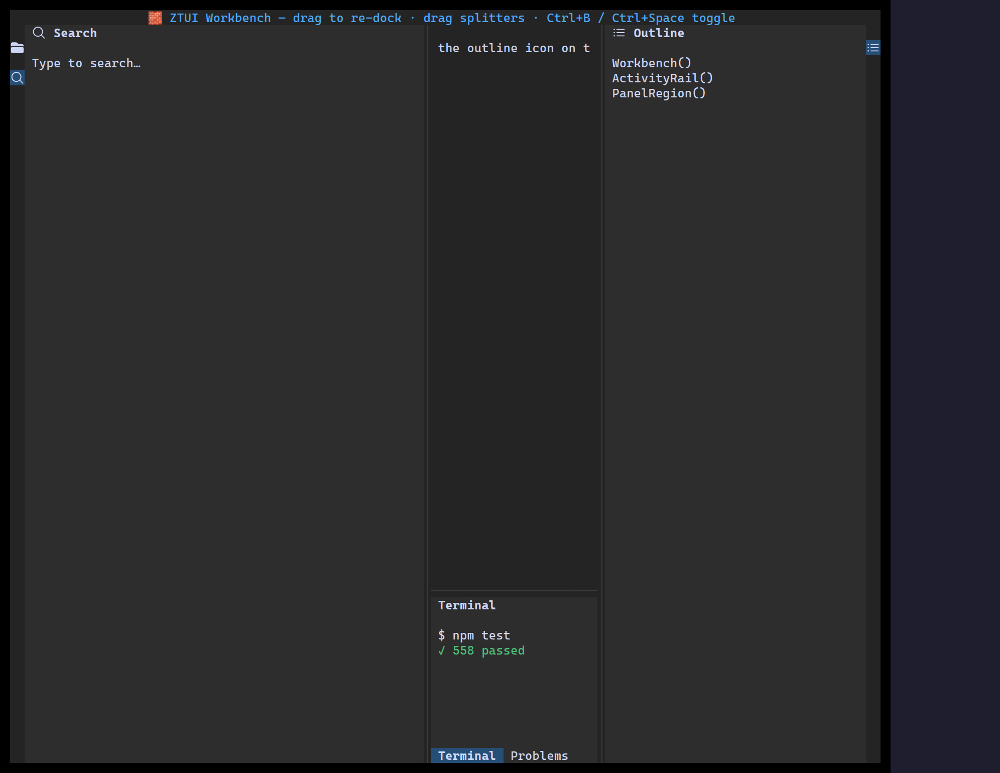

`<Workbench>` is a full IDE-style shell: hideable left/right/bottom panels driven
by an activity rail, draggable splitters, drag-to-re-dock, and a serializable
layout you can persist and restore.

## Usage

```tsx
import { Label, Workbench } from "@huyz0/ztui/react";

<Workbench
  panels={[
    { id: "search", anchor: "left", title: "Search", icon: "magnifying-glass", content: <Label>…</Label> },
    { id: "outline", anchor: "right", title: "Outline", icon: "list-bullet", content: <Label>…</Label> },
    { id: "terminal", anchor: "bottom", title: "Terminal", content: <Label>$ npm test</Label> },
  ]}
  initialOpen={["left", "bottom"]}
  onLayoutChange={(layout) => savePrefs(layout)}
>
  <Label>Editor area (children fill the center)</Label>
</Workbench>;
```

## Key props

- `panels` — `{ id, anchor: "left" | "right" | "bottom", title, icon?, content }[]`.
- `children` — the center/editor content.
- `initialOpen` / `initialSizes` — which regions start open and at what size.
- `initialLayout` / `onLayoutChange` — restore and persist a serializable snapshot.
- `toggleKeys` — per-region toggle keybindings (defaults: `Ctrl+B`, `Ctrl+Alt+B`, `Ctrl+Space`).

[Full demo →](https://github.com/huyz0/ztui/blob/main/examples/workbench_demo.tsx)
